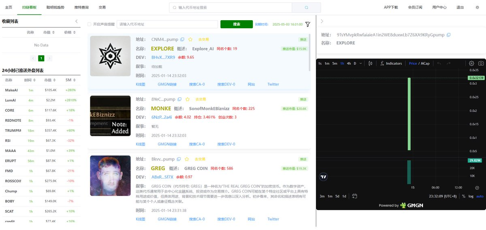
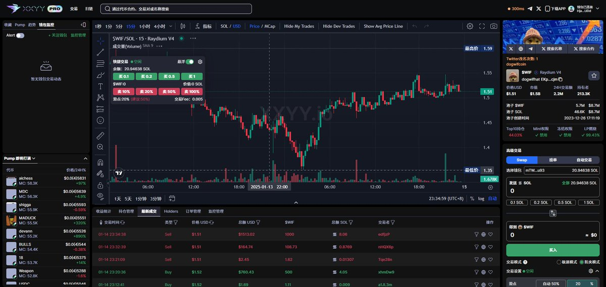
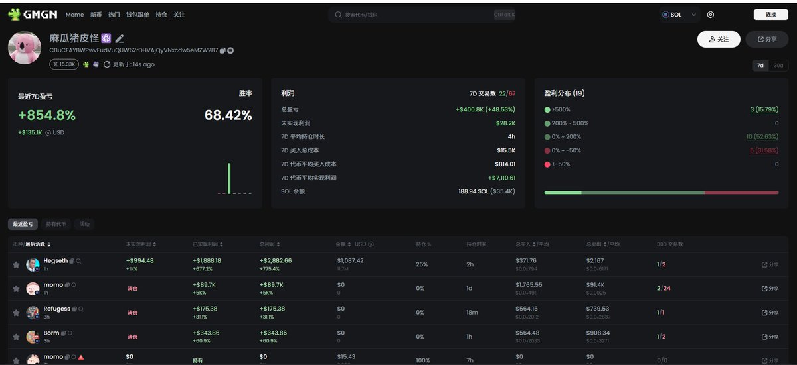

# 新手打狗必備三大工具指南：VBOT、XXYY、GMGN

> **來源**: [@zhupi_eth](https://x.com/zhupi_eth/status/1879192385462350329) | [原文連結](https://vbot.fun/#/register?ref=jGVIPsSl)
>
> **日期**: 
>
> **標籤**: `迷因幣交易` `鏈上工具` `風險管理`

---

> **來源**: [@zhupi_eth (麻瓜猪皮怪⚛️)](https://x.com/zhupi_eth)  
> **日期**: 2026-02-18  
> **標籤**: `Solana` `Meme幣` `鏈上交易` `工具推薦`

---

## 工具清單

### 1. 掃鏈工具：VBOT（收費）

**連結**：https://t.co/QjNxTn8eSP

**核心功能**：
- AI 自動解讀項目敘事
- 內盤階段快速判斷並買入
- 顯示項目籌碼結構

**注意事項**：
- DEV 持有比例過大可能是坑（但也不排除金狗）
- 需時刻注意籌碼分佈

---

### 2. 交易工具

#### 2.1 XXYY（主要交易工具）

**連結**：https://t.co/pYhOdGjgZw

**背景**：
- ABOT 停止服務後的最佳替代品
- Pepe 團隊 @PepeBoost888 開發
- 市面上頂級 KOL 都在使用

**核心功能**：
- 複製合約地址即可查看推特改名次數
- 自定義監控錢包
- 顯示 DEV 的 SELL 和 BUY 動態
- 提供手機版 APP（點擊右上角下載）

**安全提醒**：
- 雖然安全性有保障，但只要是 bot 就不要存放太多資金

#### 2.2 TG 交易機器人：Dogee

**連結**：https://t.co/xIXK9TQx2h

**適用場景**：
- 只用手機買賣幣
- 趕時間快速交易
- XXYY 卡頓時的替補方案

**特點**：
- 交易速度極快

---

### 3. 地址分析工具：GMGN

**連結**：https://t.co/e1zMKjO6Dj

**核心功能**：
- 查看買賣幣情況（包括 DEV）
- 分析持倉和籌碼結構尋找金狗
- 搜尋已認證 KOL 的地址（直接輸入名字）

---

## 完整操作流程

### 1. 準備工作
- 在 XXYY 開設帳戶
- **務必保存好私鑰**

### 2. 尋找標的
- 打開 VBOT 開始監控
- 行情好時面板刷新極快（看完一個項目可能已出現 10 個新項目）
- **運氣成分存在**

### 3. 執行交易
1. 看準想買的項目
2. 複製 VBOT 上顯示的項目地址
3. 貼到 XXYY 輸入欄
4. 使用 XXYY 交易帳戶進行交易

### 4. 購買前風控檢查

**籌碼結構檢查重點**：
- 除了 DEV 之外，是否有持倉超過 10% 的狙擊手
- 這些大戶很可能會倒貨導致虧損

---

## 總結

以上是目前普通人參與一級鏈上交易的主要工具。後續如有更好用的工具會持續更新。
