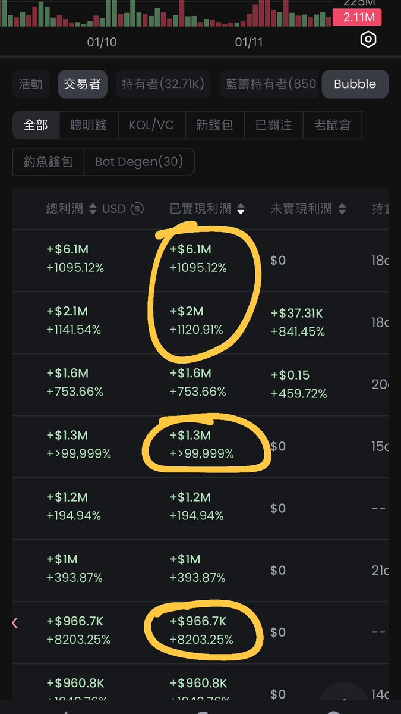

# 聰明錢地址篩選策略：如何找到優質跟單對象

> **來源**: [@0x542121](https://x.com/0x542121/status/1878098663513432357)
>
> **日期**: Sat Jan 11 15:16:29 +0000 2025
>
> **標籤**: `聰明錢追蹤` `地址篩選` `跟單策略`

---

> **來源**: [@0x542121 (𝟮𝟭⚡️0x5421)](https://twitter.com/0x542121)
> **標籤**: `聰明錢` `地址篩選` `GMGN` `跟單策略` `鏈上分析`

---

## GMGN 聰明錢地址篩選方法

之前說過 GMGN 首頁聰明錢/KOL 別跟，那聰明錢哪找？

### 篩選流程

到每個熱門代幣 ➡️ 交易者，點「已實現獲利」排序下來

### 評估指標優先順序

**不看獲利金額$$，只看爆擊倍數**

再依序檢查：
- 勝率
- 交易數
- 風控狀況

### 篩選效率

看一堆地址都沒適合的也不用氣餒，正常幾百個地址才能選出兩三個好的。

過程不用急，多花心思考慮細節。

## 需要避開的地址類型

### 大倉位操作者

常幹大倉位的地址，跟他後面不就常常被砸得頭破血流

### Bot 策略地址

勝率表面雖高，但細看收益九成是 +20% +30%，很可能是跑策略的 Bot。跟這種加上時間差，容易虧錢。

## 核心原則

**地址在精不在多**

好地址一兩個就足以帶你絕頂升天 🤤🥵🚀💦🔥
