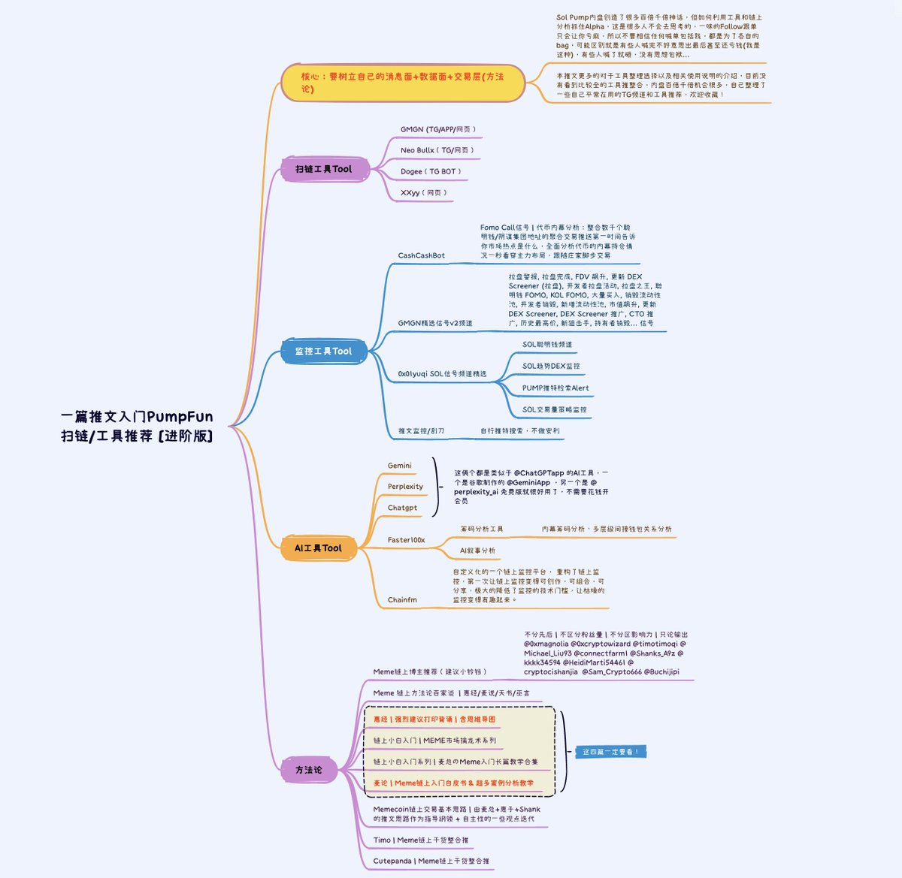
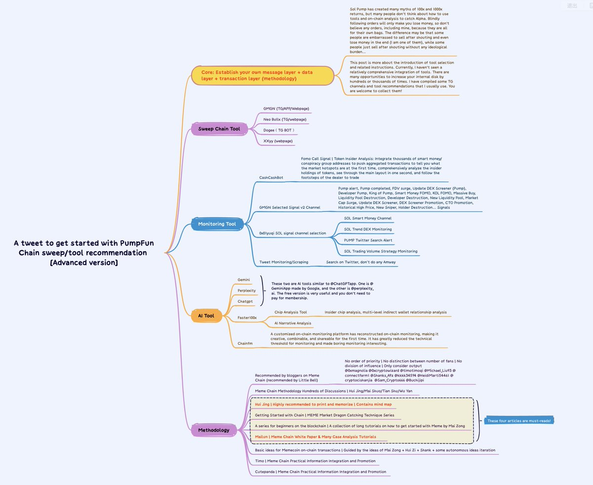

# Pumpfun 掃鏈工具完全指南及 Memecoin 交易方法論

> **來源**: [@xixikawaii](https://x.com/xixikawaii/status/1877547577996095905) | [原文連結](https://t.me/GMGN_sol_bot?start=i_QXw2uGWZ)
>
> **日期**: Fri Jan 10 02:46:40 +0000 2025
>
> **標籤**: `掃鏈工具` `Memecoin 交易` `鏈上監控`

---

我來將這篇 Pumpfun 工具指南整理成 markdown 格式的知識庫文章。

## 核心概念

要建立自己的**消息面 + 數據面 + 交易層（方法論）**

## 前言

Sol Pump 內盤創造了很多百倍千倍神話，但如何利用工具和鏈上分析抓住 Alpha，這是很多人不會去思考的。一味的 Follow 跟單只會讓你虧麻，所以不要相信任何喊單包括我，都是為了各自的 bag，可能區別就是有些人喊完不好意思出最後甚至還虧錢（我是這種），有些人喊了就砸，沒有思想包袱。

本文更多的是對工具整理選擇以及相關使用說明的介紹，目前沒有看到比較全的工具整合，內盤百倍千倍機會很多，以下整理了一些平常在用的 TG 頻道和工具推薦。

## 掃鏈工具 Tool

**注意錢包資金安全**

如果你是手機掃鏈/交易用戶的話，可以選擇 OKX Web3 錢包或者 TGBOT 電報機器人/APP：

### GMGN
- **平台**：手機 APP/網頁掃鏈/綁定 TG 使用
- **網址**：https://gmgn.ai
- **教程**：含 PUMP 入門及數據層教學

### Neo Bullx
- **平台**：網頁端掃鏈
- **特色**：老外最愛
- **網址**：https://bullx.io

### Dogee
- **平台**：TG BOT
- **特色**：交易快/跟單/掛單快
- **Bot**：https://t.me/Dogeebot

### XXYY
- **平台**：網頁端掃鏈
- **特色**：ABOT 平替/Pepe 出品
- **網址**：https://xxyy.io

## 監控工具

聰明錢監控、各類鏈上信號監控

### CashCashBot
- **功能**：聰明錢監控/籌碼分析
- **Bot**：https://t.me/CashCashBot
- **特色**：
  - Fomo Call 信號
  - 代幣內幕分析
  - 整合數千個聰明錢/陰謀集團地址的聚合交易推送
  - 第一時間告訴你市場熱點是什麼
  - 全面分析代幣的內幕持倉情況，一秒看穿主力布局
  - 跟隨莊家腳步交易

### GMGN 精選信號 v2 頻道
- **頻道**：https://t.me/gmgn_signal_v2
- **包含信號**：
  - 拉盤警報、拉盤完成、FDV 飆升
  - 更新 DEX Screener（拉盤）
  - 開發者拉盤活動、拉盤之王
  - 聰明錢 FOMO、KOL FOMO
  - 大量買入、銷毀流動性池、開發者銷毀
  - 新增流動性池、市值飆升
  - DEX Screener 推廣、CTO 推廣
  - 歷史最高價、新狙擊手
  - 持有者銷毀信號等

### SOL 聰明錢頻道
- **頻道**：https://t.me/sol_smart_money
- **策略思路**：
  - 批量監控錢包，地址集合各大 KOL，或者鏈上聰明錢包
  - 大約合計三千多個
  - 短時間內錢包集合多次買入一個代幣即會推送
  - 最多根據熱度來推送 3 次

### SOL 趨勢 DEX 監控
- **頻道**：https://t.me/sol_dex_trending
- **策略思路**：
  - 檢測鏈上 PUMP 合約
  - 如果 dexscreener 付費上趨勢，即可快速推送提醒

### PUMP 推特檢索 Alert
- **頻道**：https://t.me/pump_twitter_alert
- **策略思路**：
  - 檢測鏈上 PUMP 合約市值達到 3 萬
  - 然後根據過濾條件去查詢匹配
  - 最後符合要求策略提醒

### SOL 交易量策略監控
- **頻道**：https://t.me/sol_volume_monitor
- **策略思路**：
  - 只檢測 PUMP 外盤，拒絕內盤 PVP
  - 實時檢測外盤 5 分鐘 K 線
  - 如果交易量異常翻倍提醒
  - 研究再多，不如老老實實看著 5 分鐘 k 線和交易量
  - 金狗狗莊都會提前埋伏，從交易量上反饋結果

### 推文監控/刮刀
- 有很多，自行推特搜索，不做安利

## AI 工具

助您一臂之力：籌碼分析、AI 敘事

### 通用 AI 工具

#### Gemini
- **網址**：https://gemini.google.com
- **出品**：Google

#### Perplexity
- **網址**：https://perplexity.ai
- **特色**：免費版就很好用了，不需要花錢開會員

#### ChatGPT
- **網址**：https://chat.openai.com

### 專業工具

#### Faster100x
- **功能**：籌碼分析工具、AI 敘事分析（免 Prompt 出敘事）
- **特色**：
  - 內幕籌碼分析
  - 多層級間接錢包關係分析
- **收費**：付費制度，看自己需求選擇
- **Whitepaper**：https://faster100x.com/whitepaper

#### Chainfm
- **功能**：Meme 掃鏈新業態
- **Twitter**：@chain_fm
- **特色**：
  - 自定義化的一個鏈上監控平台
  - 重構了鏈上監控
  - 第一次讓鏈上監控變得可創作、可組合、可分享
  - 極大的降低了監控的技術門檻
  - 讓枯燥的監控變得有趣起來
- **Whitepaper**：https://chainfm.io/whitepaper

## Meme 方法論

Memecoin 交易心得

### Meme 鏈上博主推薦（建議小鈴鐺）

不分先後 | 不區分粉絲量 | 不分區影響力 | 只論輸出

- @0xmagnolia
- @0xcryptowizard
- @timotimoqi
- @Michael_Liu93
- @connectfarm1
- @Shanks_A9z
- @kkkk34594
- @HeidiMarti54461
- @cutepanda
- @cishanjia
- @sam666
- @Buchijipi

### Meme 鏈上方法論百家談

**惠經/麥說/天書/巫言**

#### 惠經
- **強烈建議打印背誦**
- **含思維導圖**

#### 鏈上小白入門系列
- **MEME 市場擒龍術系列** by @Shanks_A9z
- **麥總のMeme 入門長篇教學合集**

#### 麥論
- **Meme 鏈上入門白皮書 & 超多案例分析教學**

#### Memecoin 鏈上交易基本思路
- 由麥總 + 惠子 + Shank 的推文思路作為指導綱領
- 加上自主性的一些觀點迭代

#### Timo
- **Meme 鏈上乾貨整合推**

#### Cutepanda
- **Meme 鏈上乾貨整合**

### 關聯推文

**PUMPFUN 內盤掃鏈/外盤常用工具超全整理**

## 關聯項目方推特

- @gmgnai
- @bullx_io
- @dogee_io
- @SaBiBro666
- @useXXYYio
- @NFTFlip_AI
- @0x01yuqi
- @faster100x
- @lucas_faster
- @chain_fm

## 免責聲明

本推文是出於喜歡產品製作的第三方教程，不建議使用該工具交易（因為沒有 100% 安全的產品，畢竟經歷過 FTX 暴雷），只建議當做數據層來使用，如果使用一定要注意錢包安全，及時提現。
