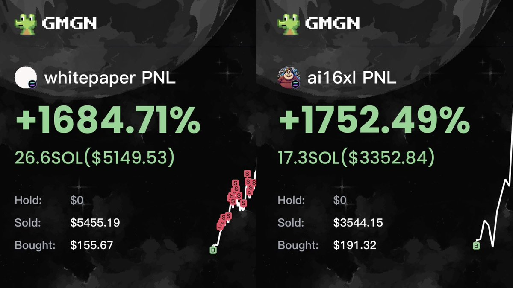

# Solana 跟單交易：賄賂費與倉位比例的平衡

> **來源**: [@0x542121](https://x.com/0x542121/status/1877249902193029164)
>
> **日期**: 
>
> **標籤**: `跟單交易` `MEV 賄賂費` `倉位管理`

---

> **來源**: [@0x542121 (𝟮𝟭⚡️0x5421)](https://twitter.com/0x542121)
> **日期**: 2026-02-18
> **標籤**: `Solana` `跟單交易` `倉位管理` `賄賂費` `Tip`

---

## 核心觀念

考慮「賄賂費(Tip)」和「下單倉位」的比例是跟單交易中非常重要的事。

## 常見錯誤配置

許多人使用以下配置：
- 本金：1-2 顆 SOL
- 每筆訂單：0.1-0.2 SOL

**此配置建議先別跟**，大概率會磨光本金。

## 成本結構分析

假設賄賂費(Tip)設定 0.02 SOL：

### Tip 成本
- Buy Tip：0.02 SOL
- Sell Tip：0.02 SOL
- **總 Tip 成本**：0.04 SOL

### 倉位占比問題
若每筆只下 0.1 SOL：
- **光 Tip 就佔倉位四成**

### 額外成本
- 跟單時間差導致 **-10～30% 價差**

### 結果
即使運氣好打到小爆擊，賺的錢只剛好付其他磨損而已。

## Tip 設定的兩難

- **Tip 不夠**：跟單速度慢，中間擠更多人，吃的價差會更大
- **Tip 太高**：佔用過多倉位，壓縮獲利空間

## 建議配置

### 本金要求
- **10 顆 SOL 起步**

### 單筆下單量
- **0.6-1 顆 SOL**

### 優勢
- Tip 能調整的空間比較大
- 幸運吃到爆擊後，才有更多浮盈來抵抗磨損期
