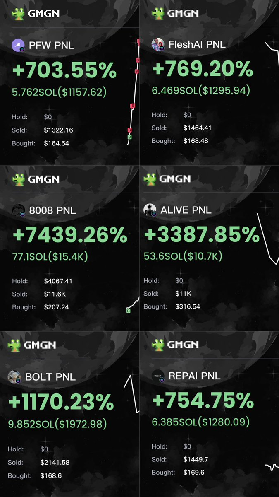
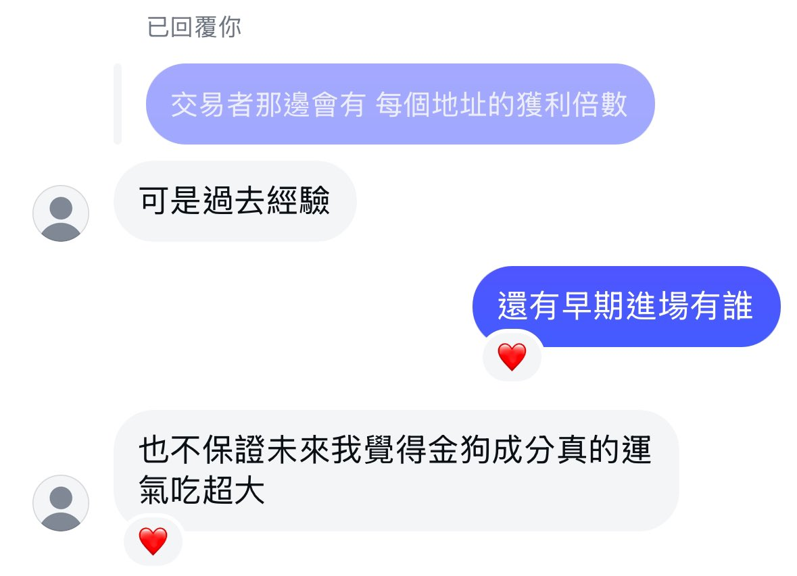

# 跟單交易風控策略：如何挑選不賠錢的地址

> **來源**: [@0x542121](https://x.com/0x542121/status/1876815943214735385)
>
> **日期**: Wed Jan 08 02:19:25 +0000 2025
>
> **標籤**: `跟單交易` `風險管理` `地址篩選`

---

> **來源**: [@0x542121 (𝟮𝟭⚡️0x5421)](https://twitter.com/0x542121)  
> **日期**: 2025-01-08  
> **標籤**: `跟單交易` `風險管理` `地址篩選` `Solana`

---

## 核心觀點

2025 第 8 天，跟單流完成今年第一個 100 萬。

早上有人詢問，找地址時如何看這地址能不能常出金狗。

這邊分享一個思路：**我認為跟單流的精髓是「找到跟了不會賠錢的地址」，而不是預想跟了這地址會吃到爆擊。**

## 地址篩選邏輯

一個地址若打了一堆爆擊，但他超會賠錢，那我會直接放棄這地址。

換個角度想：若你挑的地址都是風控很好，跟了不至於讓本金磨光的選手，只要跟單有辦法一直運行下去，是不是某天自然就會吃到金狗了🤣
