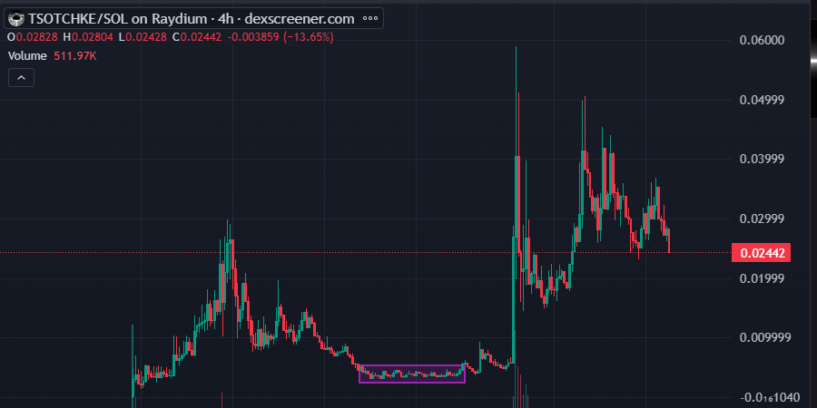
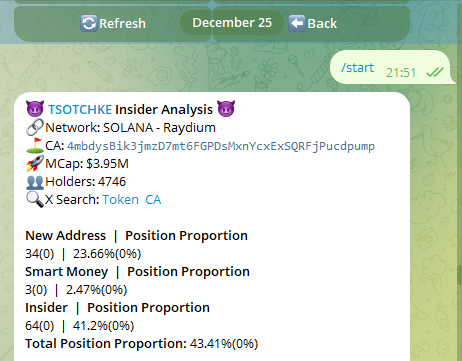

# Cash 內幕分析：尋找二段機會的策略指南

> **來源**: [@Live_2_Earn](https://x.com/Live_2_Earn/status/1876934416649384314)
>
> **日期**: Wed Jan 08 10:10:11 +0000 2025
>
> **標籤**: `內幕分析` `二段進場` `市場微觀結構`

---

> **來源**: [@Live_2_Earn (小燁 Zeno6969（起飛版）🕊️)](https://twitter.com/Live_2_Earn)
> **原作者**: [@Hovz0217](https://twitter.com/Hovz0217)
> **日期**: 2026-02-18
> **標籤**: `Cash內幕分析` `二段機會` `盤口分析` `內幕占比` `底部橫盤`

---

## 關於內幕分析

這位朋友寫的很用心，可以參考參考。

## 如何使用 Cash 內幕分析尋找二段機會

**案例代幣**：$tsochke  
CA：`4mbdysBik3jmzD7mt6FGPDsMxnYcxExSQRFjPucdpump`

## 前提條件

使用 Cash 內幕分析尋找二段機會的前提，必須滿足以下幾點：

1. **根據市場環境，從高點跌幅 80-90%**
2. **底部橫盤有一段時間，並且有護盤、吸籌行為**。在此代幣中，底部橫盤了近 7 天
3. **作為 AI 產品，一定要有延續性**，所以要去時刻關注推特、TG。關於如何尋找延續性，你可以從幾個方面去關注：
   - 白皮書發布
   - 產品優化或發布
   - 與 XXX 合作
   - 獲得 XXX 的融資（$buzz 的例子）
   - 宣布 XX 做市商
   - 項目本身就有計劃（$sandy）
4. **曾經達到過幾十 M 的高峰**，這裡主要用於判斷項目方的資金實力

## 內幕占比分析

以上都符合，那麼就開始使用 Cash 內幕分析，當時就觀察到（見圖 2）**內幕占比是 43%**。這是一個很高的數字，同比還有 $evan、$sandy 等，他們高達 50%。

這裡告訴你幾個信息點：
1. **團隊強控籌，拉盤成本會低**
2. **項目方還有後續**

這時候你就可以擇機入場，靜待花開。

## 占比解讀指南

下面就來科普一下，占比的用處，以下觀點解釋我自己總結，可以作為參考：

### 25-30%（謹慎）
如果市值足夠低，相對而言在底部橫盤，比例逐漸增加，那麼盤面樂觀；如果市值特別高，那必須冷靜下來，讓它橫盤幾天看情況（參考 $gnz 40M 的時候內幕占比只有 26%，對比 $buzz 同市值情況下有 50%）

### 30-40%（稍微樂觀）
盤面調整階段，占比維持在這個分值的情況下，可以選擇上個首倉；跌幅到一定程度再補倉

### 40%+（很樂觀）
這個占比亮出來，只要背景好，團隊強。你不 fomo 的情況下，找準點位進去，是能夠吃一筆不錯的收益

## 案例總結

tsochke 是一個可遇不可求的例子，我觀察下來，它是最穩的，其次還有 $grift、$avb、$ubc，但是他們的占比都沒 $tsochke 高。

以上就是如何用指標尋找切入點，使用 Cash 內幕分析，關注 @SaBiBro666 @CashCashBot_EN
