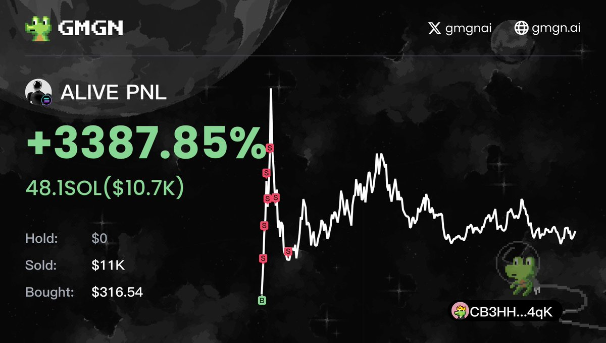

# Solana 跟單流完整指南：聰明錢篩選與 Bloom Bot 實戰

> **來源**: [@0x542121](https://x.com/0x542121/status/1876301391704347034) | [原文連結](https://t.me/BloomSolana_bot?start=ref_AFXLWYTQO5)
>
> **日期**: Mon Jan 06 16:14:46 +0000 2025
>
> **標籤**: `跟單交易` `Solana` `交易機器人`

---

> **來源**: [@0x542121 (𝟮𝟭⚡️0x5421)](https://twitter.com/0x542121)
> **日期**: 2025-01-XX
> **標籤**: `Solana` `跟單交易` `BloomBot` `聰明錢` `Meme幣`

---

## 背景

作者因私訊詢問過多，統一回答關於 Solana 跟單流的常見問題，並分享自己的實戰經驗。作者本人 30 顆 SOL 起步，三個月打到 600 顆左右；另有學弟 10 顆 SOL 起步，一個半月速通至 1400 顆 SOL（A8）。

## 跟單流核心要點

跟單流有兩大重點，各佔 50%，**缺一不可**：

### 1. 聰明錢篩選

**基本條件**：
- 優先找勝率 50%+ 的地址
- 30 日交易代幣數落在 100-300 的 PVP 小將

**避雷條件**（必須排除）：
- 虧損控制差：虧損大多是 -70% / -90% 才割肉的地址
- Hold 虧損幣等奇蹟：一堆虧損幣 Hold 著不賣的地址
- GMGN 首頁的聰明錢及 KOL：後面太多人跟單 + 割跟單 Bot 在等，跟了大概率會賠錢

**重點**：跟單流非常注重**資金流動性**，有以上兩種壞習慣的地址，光磨損就磨死。

### 2. 跟單速度

與跟隨對象中間每多一人，收益就差 5-20% 不等。這就是為什麼對方賺錢，你卻賠錢的主因。

**最佳狀況**：貼著對方屁股買入。這時 Bot 和設定就非常重要。

## 跟單失敗的主因

不管用哪家 Bot，跟單失敗的主因都是：
- **滑點不夠**（滑點 = 你可接受的價差）
- **賄賂費不夠**（賄賂費能加快跟單速度）

當跟單速度不夠快，中間會夾雜其他人買入，你與跟隨對象的價差自然就高，最後超過滑點，跟單就失敗了。

## 如何做到 0 秒跟單

### Bloom Bot（主推）

- 速度保證快，平均落在 0-2 秒
- 有時甚至能同區塊跟進
- Telegram: [@BloomSolana_bot](https://t.me/BloomSolana_bot)
- Portal: https://t.me/bloomportal
- Docs: https://docs.bloombot.app/

### Dbot（高頻交易替代方案）

- 花 39 美元升 Pro 會員
- 手續費能降至 0.03%
- 適合高頻交易場景

## 常見問題 Q&A

**Q: 學弟起始資金多少？**  
A: 10 顆 SOL 起步，速通 1400 顆 SOL，一個半月直達 A8。

**Q: 學長跟單賺多少了？**  
A: 30 顆起步，目前三個月只打到 600 顆左右。

**Q: 學弟後續？**  
A: 早上起床看錢包發現達到 A8，目前準備出金 700 萬台幣。

**Q: 有開群或收費嗎？**  
A: 開群 / 收費 / 開課，目前皆沒打算。

**Q: 為什麼會接觸跟單流？**  
A: 因為自己手操 PVP 從來沒贏過，只好換個角度玩，專業的事就交給專業的人。

## 延伸閱讀

作者在 @DA_Labs_ 發表的兩篇教學：
1. [跟單流教學（一）](https://t.co/ZWxPzdw9qr)
2. [跟單流教學（二）](https://t.co/HP4wokCUWe)

建議想嘗試跟單流的朋友把這兩篇看完，可以少走很多彎路。

## 風險提醒

- 目前跟單流算冷門，風險其實也高
- 並非想像中的躺平起床就賺錢
- 在真正開始前，記得做好功課並 DYOR（Do Your Own Research）
