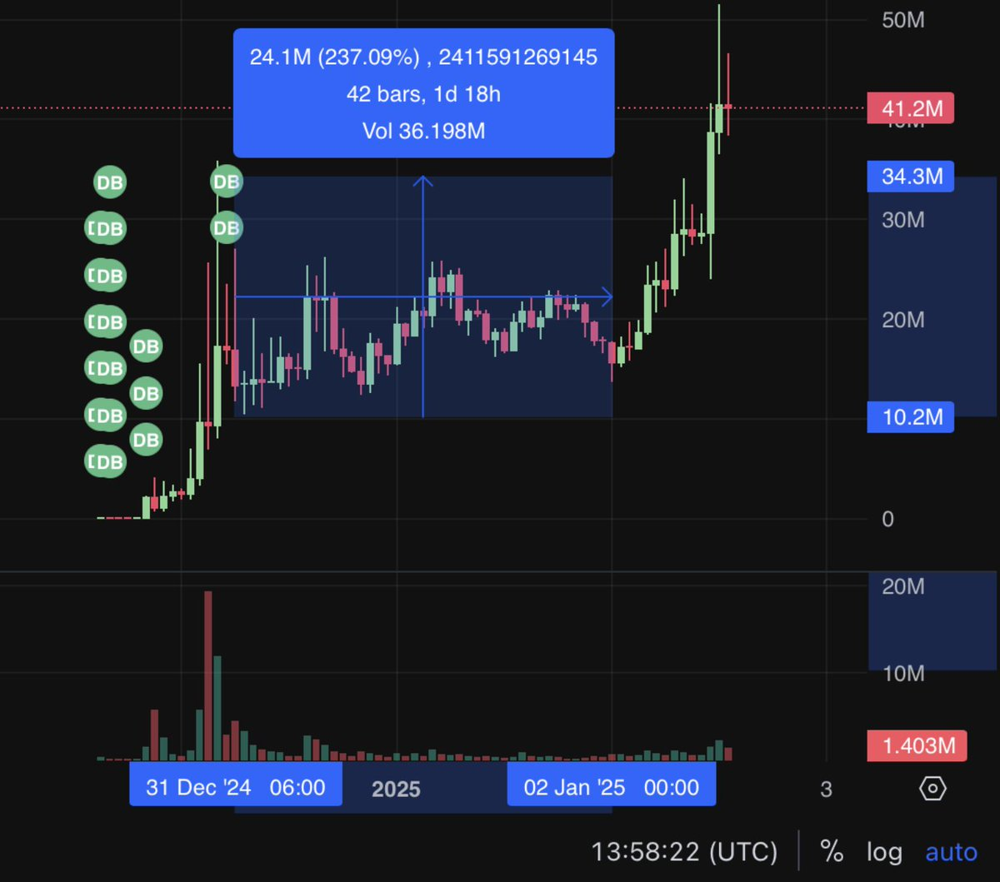

# Dune 快速抓取地址小工具使用教程

> **來源**: [@cryptoxfeng](https://x.com/cryptoxfeng/status/1875489053279449427) | [原文連結](https://dune.com/test_as121/playground)
>
> **日期**: Sat Jan 04 10:26:49 +0000 2025
>
> **標籤**: `鏈上數據` `Dune分析` `工具教程`

---

> **來源**: [@cryptoxfeng (Feng)](https://twitter.com/cryptoxfeng)
> **日期**: 2025-01-25
> **標籤**: `Dune` `工具教學` `地址抓取` `鏈上數據`

---

## 工具介紹

快速扒地址小工具使用教程。

連結：https://dune.com

## 使用步驟

### 1. 註冊 Dune 帳號

訪問 https://dune.com 註冊帳號，設置郵箱和密碼。

### 2. 打開看盤網頁並設置時區

打開常用看盤網頁，右下角時區切換到 UTC。

以 zailgo 為例：https://zailgo.com

### 3. 篩選時間範圍

如圖所示，設置篩選條件：
- 開始時間：2024-12-31 06:00
- 結束時間：2025-01-25 00:00

**注意**：如果想要包含結束時的那條 K 線，`end_datetime` 應該設為 2025-01-25 01:00，即向後一個週期。

