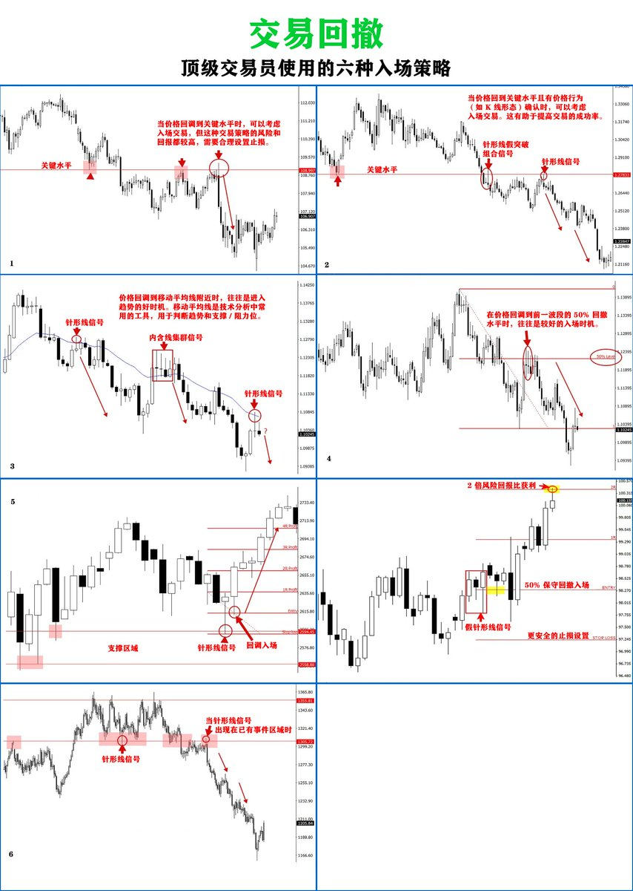

# 回撤交易：頂級交易員的 6 種入場策略

> **來源**: [@DtDt666](https://x.com/DtDt666/status/1874726515252117860)
>
> **日期**: 
>
> **標籤**: `回撤交易` `入場策略` `風險回報比`

---

> **來源**: [@DtDt666 (看不懂的SOL)](https://twitter.com/DtDt666)
> **標籤**: `回撤交易` `交易策略` `技術分析` `入場點` `風險回報比`

---

## 回撤交易的優勢

### 🟠 更高盈利可能性的入場
回撤的本質在於，當回撤結束後價格仍會繼續回到此前的波動方向。因此，回撤提供了一個很好的入場機會，如果價格走勢信號出現在回撤後，那麼更是意味著高盈利可能性的入場。

### 🟠 更少提前被淘汰的止損設置
回撤讓止損設置更加靈活，你可以將止損設置在離可能被觸發區域更遠的地方，比如讓止損遠離重要價位或者移動均線等。

### 🟠 更好的風險回報比
理論上說，回撤入場能讓你設置更緊的止損，因為此時你入場更靠近關鍵價位。更緊的止損意味著更好的風險回報比。當然，是否設置更緊的止損由你自己決定。

即使這時候你沒有選擇更緊的止損，而是仍選擇正常的止損範圍，交易的風險回報也依然變得更好一些。原本 100 點的止損、200 點的盈利目標現在變成了 100 點的止損、250 點的盈利目標，因為回撤入場時，已經回撤的空間這時候成為你盈利的一部分。

---

## 不同的回撤入場類型

### 1. 在沒有價格行為信號時回撤入場
價格回撤到重要水平價位。圖表上並沒有明顯的價格走勢信號，但是我們看到價格在重要價位處很快就賣出了。因此我們就可以發現這裡有潛在的機會。

### 2. 價格回撤到重要價位，並出現融合點
這應該是我最喜歡的回撤交易策略：在日圖中等待價格回撤到重要價位，然後等待這裡形成明顯的價格行為信號。我認為這是盈利可能性最高的方式。

### 3. 回撤至移動均線（價格均值）
市場趨於回歸均值，這個均值可以通過移動均線來看。下圖圖表中是 21 日移動均線，用於在日圖上看趨勢。如果價格回撤到這附近，那麼應該密切留意是否有價格走勢信號也出現。

### 4. 50% 區域回撤
價格傾向於在主要波動近 50% 的地方回撤。如果你仔細看任何圖表，都會發現這種現象經常發生。因此，我們可以留意這些 50% 的區域附近的回撤，回撤結束後，價格又會繼續之前的波動。即使這種現象不是每一次都出現，但是它發生的頻率如此之高，完全可以作為我們回撤交易的重要工具。

### 5. 在作為信號的蜡燭圖或信號區域中回撤入場
另一個能有效利用回撤的方法和上面提到的有所不同。我把它叫做 50% pin bar 回撤。也就是說，出現了一個較長影線的 pin bar 時，價格可能回撤到這根 pin bar 的中間，這時候是很好的入場機會。

**示例：**
- 等待價格回撤到前面 pin bar 的 50% 時入場，盈利有可能達到 4 倍
- 等待價格回撤到虛假形態組合的 50% 處入場，盈利可能達到 2 倍

### 6. 價格回撤到事件區域時入場
價格回撤到被我稱為事件區域的地方，這是一個具有極高盈利可能的機會。價格回撤到事件區域，也就是 pin bar 信號形成的地方,後面又出現了看跌 pin bar，意味著價格將出現大幅下跌。

---

## 總結

希望現在你對價格走勢回撤有一個更清晰的認知，也了解為什麼這麼多交易者看中回撤交易。

當然，回撤交易的內容還有很多，這篇分享主要還是在於提供基礎知識，讓你即刻就可以開始回撤交易的實踐。
