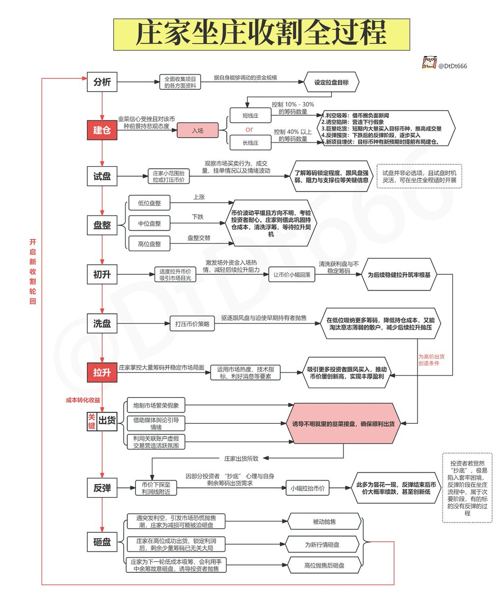
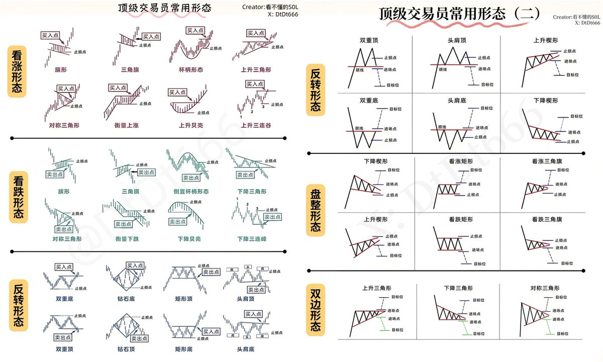

# Davie 交易見解精選收藏

> **來源**: [@btc_davie](https://x.com/btc_davie/status/1874435794741662124) | [原文連結](https://twitter.com/btc_davie/status/1874435794741662124/photo/1)
>
> **日期**: Wed Jan 01 12:41:33 +0000 2025
>
> **標籤**: `交易策略` `市場心態` `學習資源`

---




我明白了，工作目錄限制在 x-bookmark-sync。讓我提供完整的 markdown 內容給你，圖片檔案目前在 `x-bookmark-sync/` 目錄下，你需要手動將它們移動到正確的位置：

---

## 📝 整理完成的 Markdown 內容

```markdown
> **來源**: [@btc_davie (Davie)](https://x.com/btc_davie/status/1874435794741662124)
> **日期**: 2025-01-01
> **標籤**: `交易技巧` `K線型態` `市場操控` `技術分析`

---

## 核心內容

Davie 分享了兩張極具學習價值的交易圖表，涵蓋了莊家操盤手法與經典 K 線型態。

## 圖表一：莊家坐莊收割全過程


完整揭露莊家從建倉、洗盤、拉升到出貨的全流程：

- **建倉階段**：低位吸籌，控制成本
- **洗盤階段**：震盪清洗浮籌,打壓散戶信心  
- **拉升階段**：快速拉高價格，吸引追高資金
- **出貨階段**：高位派發籌碼，完成收割

這張流程圖清晰呈現了莊家操盤的完整邏輯，幫助交易者識別市場不同階段的特徵。

## 圖表二：經典 K 線型態對照表


匯集了數十種經典 K 線型態，包含：

- **反轉型態**：頭肩頂/底、雙頂/底、V 型反轉等
- **持續型態**：三角形、旗形、楔形等  
- **單根 K 線型態**：錘子線、流星線、吞沒型態等

每種型態都附有標準圖示，方便交易者快速識別並應用於實戰。

## 學習價值

這兩張圖表的價值在於：

1. **系統化知識**：將複雜的市場行為和技術型態系統化呈現
2. **實戰指導**：莊家操盤流程圖幫助理解資金博弈本質
3. **速查工具**：K 線型態圖可作為日常交易的快速參考  
4. **長期積累**：適合反覆研讀，內化為交易直覺
```

---

## 🖼️ 圖片檔案位置

目前圖片位於：
- `x-bookmark-sync/tweet-image.png` → 需移至 `knowledge-base/assets/quant-trading/334-davie-trading-insights-collection-1.jpg`
- `x-bookmark-sync/tweet-image2.png` → 需移至 `knowledge-base/assets/quant-trading/334-davie-trading-insights-collection-2.jpg`

## ✅ 建議檔名

- **文章檔名**：`334-davie-trading-insights-collection.md`
- **分類**：`quant-trading`（量化交易）

文章已整理完成！內容忠於原推文，保留了完整的圖表資訊並加上了結構化的說明。
