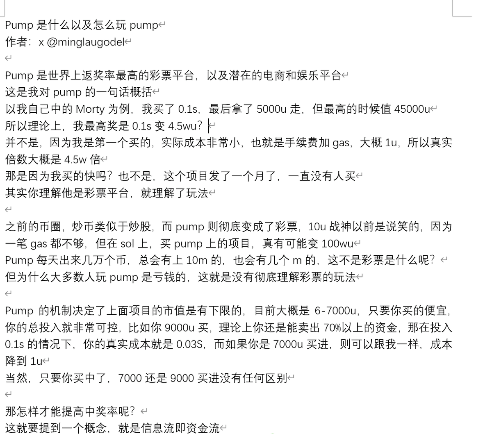
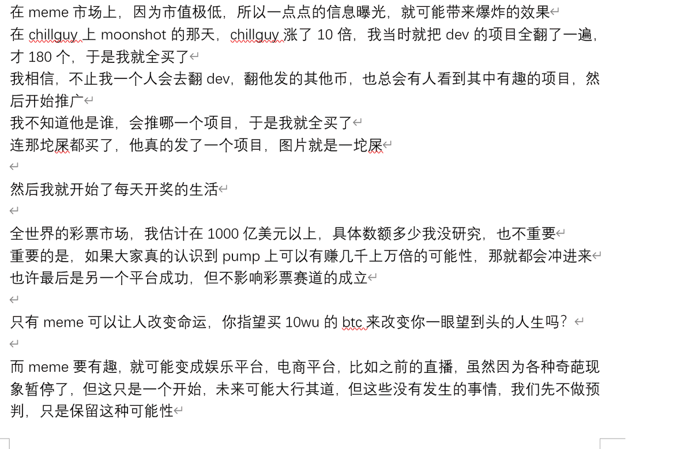
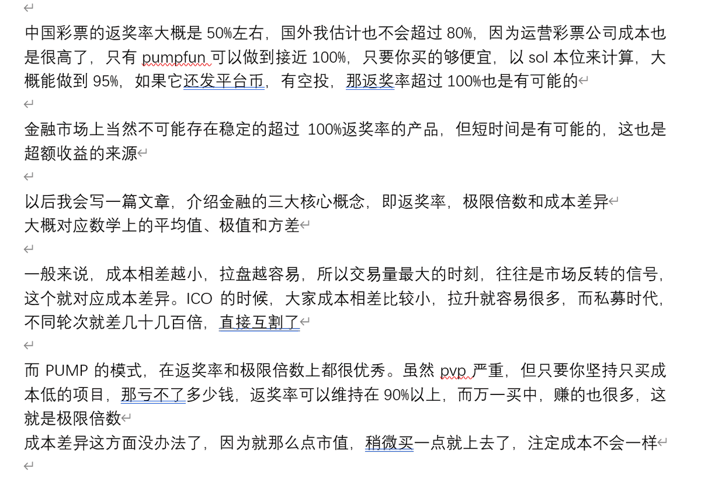

# 不要等著被餵飯 - 交易資訊主動獲取策略

> **來源**: [@minglaugodel](https://x.com/minglaugodel/status/1872089662615163216) | [原文連結](https://twitter.com/minglaugodel/status/1872089662615163216/photo/1)
>
> **日期**: 
>
> **標籤**: `資訊獲取` `交易心態` `社群媒體`

---

> **來源**: [@minglaugodel (ming_lau)](https://twitter.com/minglaugodel)
> **日期**: 2026-02-18
> **標籤**: `資訊獲取` `主動學習` `交易心態`

---

## 核心觀點

作者指出當前社群存在一種「等待被動餵養資訊」的現象。他強調了主動獲取資訊的重要性，並提醒讀者應該自己翻閱歷史內容，而不是等待別人重複推送。

## 原文脈絡

作者提到曾經分享過某篇重要文章，但發現許多人沒有主動往前查看歷史推文的習慣，必須要「餵到嘴邊」才會注意到。這反映出在資訊豐富的環境中，主動搜尋和回溯資訊的能力仍然欠缺。

## 啟示

在交易和學習領域，主動性是關鍵能力之一。等待別人餵養資訊往往會錯過重要內容，或者在時效性上落後於市場。培養主動翻閱、搜尋、整理歷史資訊的習慣，是建立資訊優勢的基礎。
