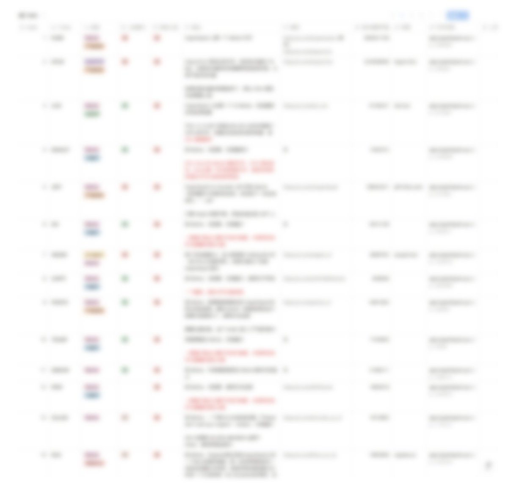

# Hyperliquid 生態工具完整指南

> **來源**: [@0xcryptoHowe](https://x.com/0xcryptoHowe/status/1870445977619804654)
>
> **日期**: Sat Dec 21 12:27:26 +0000 2024
>
> **標籤**: `Hyperliquid` `交易工具` `生態導覽`

---

> **來源**: [@0xcryptoHowe (Howe 祛魅 | 𝟎𝐱𝐔💢)](https://twitter.com/0xcryptoHowe)
> **日期**: 2026-02-18
> **標籤**: `Hyperliquid` `交易工具` `生態指南` `工具集`

---

## 簡介

這是目前最全的 Hyperliquid 生態工具整理帖。在深度調研了 Hyperliquid 生態後,發現了很多實用工具和網站。

## 工具列表

接下來按順序介紹所有工具:

**注意**: 有些線程會包含多個工具,別看漏了

## 背景說明

作者在市場環境很差的情況下,選擇沉下心來把之前錯過的 Hyperliquid @HyperliquidX 生態全部梳理了一遍。

雖然帳戶也在滴血,但按照槓鈴策略,虧損還在能承受的範圍內。在整個市場非常嘈雜的時候,更應該沉下心來看看哪裡的流動性好,然後去做研究尋找機會。

該屏蔽的噪音還是要屏蔽的。這裡預告後面 Hyperliquid 的推文:明天會發布工具篇,生態表格還在完善,具體要不要發出來還在考慮,畢竟這算是費了很大心血做的。
