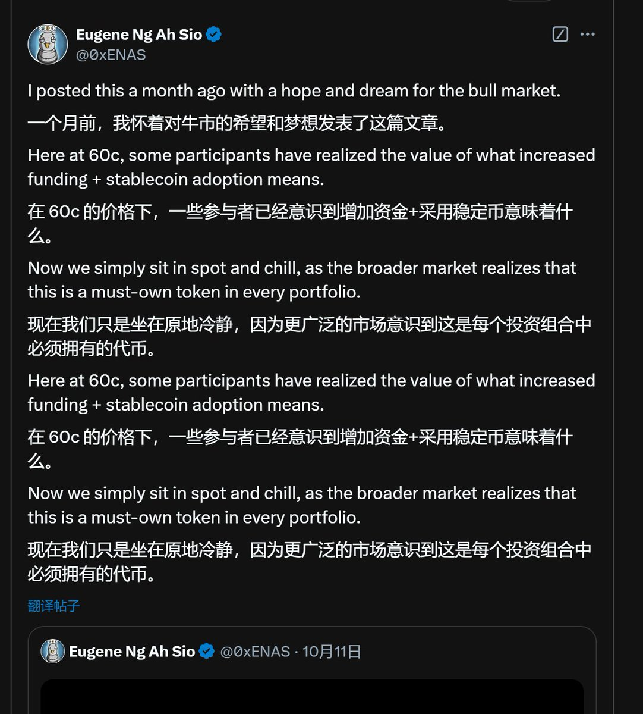

# ENA 波段規律分析與交易實戰

> **來源**: [@liguagua](https://x.com/liguagua/status/1870286315914441107)
>
> **日期**: Sat Dec 21 01:53:00 +0000 2024
>
> **標籤**: `波段交易` `技術分析` `風險管理`

---

> **來源**: [@liguagua (瓜哥)](https://twitter.com/liguagua)
> **標籤**: `ENA` `波段交易` `交易規律` `Twitter信號` `套保策略`

---

## 前言：拳擊手的觀察哲學

瓜哥的拳擊教練說過一個故事，他關注的一個拳手，喜歡先讓對手打，在持續的防守中，觀察對手的出拳節奏，找到規律以後，幾下子就把對手打崩了。

瓜哥這一季就觀察到了 ENA 的一些波段規律。

## ENA 波段規律整理

### 1. 推特鴿子的信號規律

推特鴿子一定是個跟項目方有勾兌的人，他在 ENA 橫盤臨近突破新高時，喊過 4 次，然後就突破了：

| 日期 | 漲幅 | 時長 | 結果 |
|------|------|------|------|
| 11.11 | 10% | 3.5h | 放量見大頂 |
| 11.23 | 8.8% | 3h | 橫盤見頂 |
| 12.4 | 7.6% | 3.5h | - |
| 12.6 | 2.2% | 4h | - |

### 2. 強力上漲中喊單 = 放量見頂

如果是在 ENA 強力上漲中喊，基本就要放量見頂了（11.7 15點）。

### 3. 鴿子的其他幣種勝率

不過鴿子自己也是個傳奇交易員，他在大餅、二餅上的準確率，接近 100%（雖然最近 SOL 滑鐵盧，虧了 1000w 刀+，但不影響他這塊的高勝率）。

**瓜哥的操作**：在他喊二餅的時候，瓜哥會跟隨做多 ENA。

### 4. 官推喊單規律

官推這一季，也下場喊單了，帶點 meme 口吻的 4 次喊多，後續都是一波漲幅，成功率 100%（吹資金費沒有意義）。

### 5. 單邊下跌與反彈規律

ENA 自 0.277 開啟漲幅以來，1h 級別單邊最大下跌幅度在 **10.5%~16.5%**，隨後都會反彈 **7%~24%**，時間一般在 4h 及以上。

**注意**：1 刀以上，這個規律失效，體現在單邊下跌幅度明顯延長。

## 瓜哥的實戰成績

瓜哥這一季沒有做好，瞎幾把搞，導致獲取積分成本變高，總成本在 **100w 刀**。

通過以上這些規律，已經波段到 **30w 刀**了。

**一個戰略錯誤，只能靠無數個戰術正確來彌補。**

## 套保操作

瓜哥已經在均價 **1.045**，完整套保了這一季的預期空投，套保標準 **1億積分 / 3000 代幣**。
