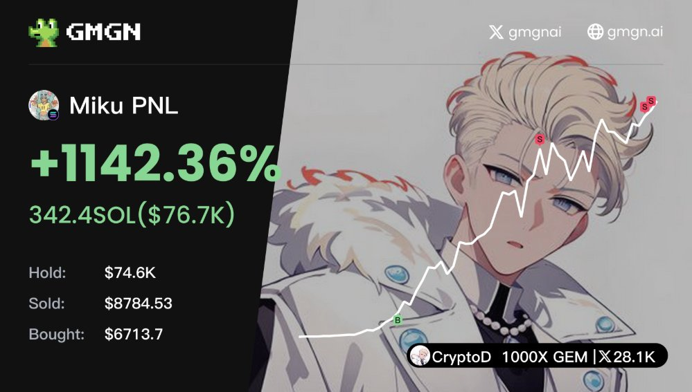

# Miku 金狗交易時段分析

> **來源**: [@CryptoDevinL](https://x.com/CryptoDevinL/status/1867686314440897019) | [原文連結](https://twitter.com/CryptoDevinL/status/1867686314440897019/photo/1)
>
> **日期**: Fri Dec 13 21:41:31 +0000 2024
>
> **標籤**: `交易時段` `加密貨幣` `市場微觀結構`

---

> **來源**: [@CryptoDevinL](https://twitter.com/CryptoDevinL)  
> **日期**: 2026-02-18  
> **標籤**: `memecoin` `trading-hours` `golden-dog` `市場時機`

---

## 金狗交易最佳時段

每天凌晨 4~5 點是金狗時間，建議別睡。

**案例**: $Miku

---

## 要點說明

- **時段**: 凌晨 4~5 點（UTC+8）
- **類型**: 金狗（高潛力 memecoin）
- **建議**: 保持清醒監控盤面
