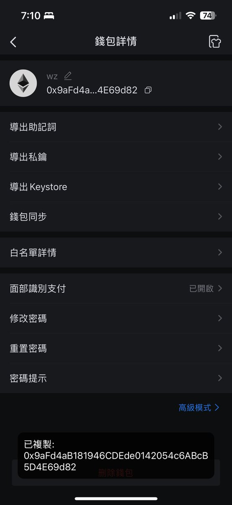

# Smart Money 錢包追蹤指南

> **來源**: [@Wayne145591](https://x.com/Wayne145591/status/1867346620721078635) | [原文連結](https://twitter.com/Wayne145591/status/1867346620721078635/photo/1)
>
> **日期**: 
>
> **標籤**: `錢包分析` `Smart Money` `鏈上數據`

---

> **來源**: [@Wayne145591 (Waynecoin)](https://twitter.com/Wayne145591)  
> **標籤**: `smart-money` `錢包追蹤` `鏈上分析`

---

## 錢包地址

**關注錢包**：`0x9aFd4aB181946CDEde0142054c6ABcB5D4E69d82`

這是一個值得追蹤的 Smart Money 錢包地址，可以用來觀察鏈上交易動態和投資策略。

**查詢連結**：[點擊查看鏈上數據](https://t.co/xgFcPbUuqM)
