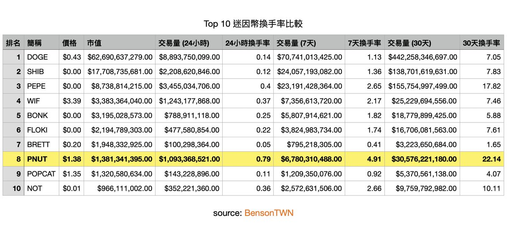

# 高換手率與主力派發：迷因幣籌碼流動分析

> **來源**: [@BensonTWN](https://x.com/BensonTWN/status/1865055948894801989)
>
> **日期**: Fri Dec 06 15:29:23 +0000 2024
>
> **標籤**: `換手率` `籌碼派發` `主力行為`

---

> **來源**: [@BensonTWN (Benson Sun)](https://twitter.com/BensonTWN)
> **日期**: 2026-02-18
> **標籤**: `換手率` `籌碼分析` `迷因幣` `主力派發` `市場微觀結構`

---

## 高換手率的兩種情境

### 情境一：價格拉升期間的高換手率

如果價格在短時間內快速拉升並伴隨高換手率，很可能是主力在拉高過程中逐步派發籌碼。此時主力利用市場情緒和追高資金,將籌碼高位賣給追漲的散戶。

這種情況通常發生在：
- 市場情緒高漲，追高行為明顯
- 幣價已經經歷多輪上漲，市場參與者期望繼續突破

### 情境二：大幅回撤後盤整區的高換手率

表明新資金介入的跡象較為明顯，他們可能在吸收早期獲利大戶或高位接盤者的恐慌性拋售的籌碼，為後續行情鋪路。

這類情況的特徵是：
- 交易量活躍但價格波動幅度逐漸減小，呈現盤整型態
- 高換手率表明籌碼正在集中到少數資金手中（換莊）

## 核心觀點

無論是哪種狀況，高換手率都代表較高的流動性以及市場關注度。

## 案例分析：$PNUT

前十大市值迷因幣換手率比較數據顯示：

$PNUT 市值排第九，但單日換手率、7 日換手率、30 日換手率三項數字全部都排名第一。

最近 $PNUT 一直都在 $1-$1.5 之間盤整，盤整期還能有這麼高的換手率跟交易熱度，意味著籌碼正在換手，可能是新資金介入吸籌的訊號。
