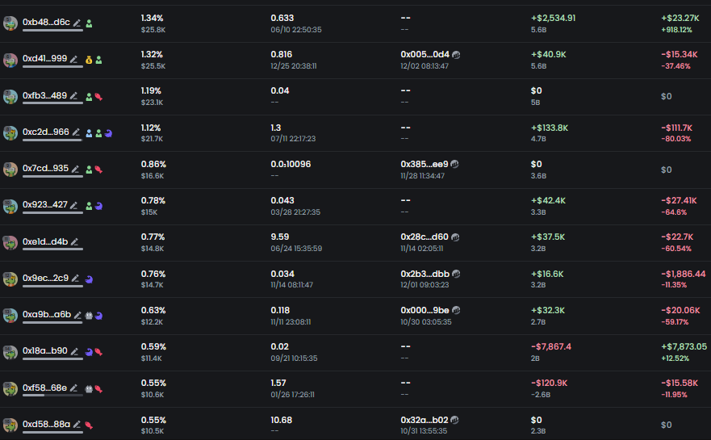

# Meme 幣交易策略：PVP 盤 vs 莊盤判斷與操作指南

> **來源**: [@Michael_Liu93](https://x.com/Michael_Liu93/status/1863902813241426237) | [原文連結](https://gmgn.ai/)
>
> **日期**: 
>
> **標籤**: `Meme 幣` `盤子分析` `錢包追蹤`

---

> **來源**: [@Michael_Liu93 (憨厚的麥總)](https://twitter.com/Michael_Liu93)
> **日期**: 2026-02-18
> **標籤**: `Meme幣` `交易策略` `PVP盤` `莊盤` `鏈上分析`

---

## 前言

麥總長篇 Meme 教學第一篇：你在決定衝一個 meme 幣之前，你最最最最最先需要問自己的問題是：這個盤子是什麼盤？是 PVP 盤還是莊盤？這件事是你衝任何 meme 之前一定要回答的問題，如果這都不了解就瞎衝，那你就不可能長期在這場遊戲裡獲勝，所以我把這個當作 Meme 教學長篇連載的第一篇。

## PVP 盤 vs 莊盤：交易策略差異

### PVP 盤的特點

**上限特性**：
- 上限通常很低
- 大家拼的是挖掘信息的速度
- 止盈點是短期情緒的高點

**交易策略**：
- 如果你看到信息晚了就別追了
- 如果你看到最早上車的那批錢包開始卸貨了，你也就該跑了

### 莊盤的特點

**上限特性**：
- 上限更高
- 能上幣安、OK、Bybit 的這些 Meme 無一例外都是強莊盤

**交易策略**：
你交易這種盤子拼的是：
1. 找到「靠譜莊」的能力
2. 通過分析敘事
3. 分析運營用心程度
4. 監控錢包揣摩做市商意圖
5. 在莊不斷的拉砸洗盤中，牢牢抓住

**重要提醒**：這種盤子你也不要怕高，因為上限跟 PVP 盤子不一樣。

## 常見誤區：不能只看敘事判斷

很多人覺得可以看敘事去判斷是不是莊盤，但這個大錯特錯！！！

**案例**：
- Moodeng
- Pnut
- RIF

這些敘事看起來像是很自然的「熱點」，但其實偽裝下都是強莊盤，你去拿 PVP 盤的玩法玩這種盤只會被甩下車或者賣飛。

## 如何判斷莊盤：實戰方法

### 最簡單的判斷方式

**步驟**：
1. 打開 https://gmgn.ai
2. 直接去看這個盤子的 TOP10-20 的地址
3. 前排地址是 alpha 交易者和 P 小將的地址嗎？還是莊錢包的地址？

**核心原則**：
強莊盤的前 10-20 在前期是不可能讓鏈上 hunter 混進去的。

### 識別莊錢包的技巧

雖然很多做市商會將前排錢包混進去一些其他交易偽裝成交易者錢包，但可以通過以下方式識別：

**交易風格異常**：
- 如果這個地址在這個盤子上的交易風格明顯跟它在其他盤子上的不同，那基本就是莊錢包無疑
- 例子：別的幣只買了一兩筆 1000u 的，這個盤子突然梭了 10wu，然後一直在做波段，那你可以理解那個 1000u 的買單就是偽裝成交易者錢包的煙霧彈

**地址標記特徵**：
- 前排地址如果有特別多標紅的小魚標或者狙擊標，那基本也是莊地址

### 實戰案例分析

**失敗案例**：
- $Spell（被國人 KOL Rug 的藝術家代幣）
- $PAC（在 Eth 上的政治幣）

**失敗原因**：
懂了這層邏輯，再去看前幾天這些幣的前排地址，你就知道為什麼這種敘事這麼不錯的盤子起不來了，因為本質上都是 PVP 盤。

## 進階技巧：判斷莊的出貨情況

### 危險信號

如果你看到一個莊盤的前 10-20 持幣已經開始出現一些交易者的地址了，那你就一定得小心了。

**含義**：
- 說明莊已經卸貨不少
- 接盤的人開始進 TOP10-20 了

### 不同情況的分析

**大市值或已上大所**：
- 還好，因為流動性夠多
- 莊控籌也不再需要那麼緊

**鏈上流動性不夠的情況**：
- 莊控籌不緊不是不敢拉，是真的拉不動
- 這種盤子小心莊直接棄盤了

## 重要觀念糾正：前排盈利的真相

### 常見錯誤想法

「某某盤子好想上，但前排錢包盈利太多，怕砸盤。」

**能說出這個話的就是沒玩明白這個遊戲的。**

### 正確理解

**PVP 盤**：
- 可以怕前排盈利多
- 因為 PVP 盤是極短期的零和博弈
- P 小將盈利多了隨時可以蓋在你頭上，然後畫個聖誕樹出來

**莊盤**：
- 前排盈利都是莊用自己的錢拉的
- 前排盈利對他來說是空氣
- 他砸盤實際砸的是他自己的腳

**最差情況**：
反而玩莊盤最差的情況其實是看到前排盈利不多或者已經虧損：
- 說明莊控籌不緊
- 已經把貨倒給這批接盤俠之後跑了
- 前排都是接盤套牢的
- 後面誰來拉？你拉還是我拉？

### 實戰案例：$doggo

**案例分析**：
看看以太上的 $doggo 的前排錢包，這就是典型的莊已經完成大部分收割並棄盤了。

**結果**：
- 這種盤子幾乎不可能再起來
- 尤其是如果狗莊出貨也不出完還剩點籌碼在裡面，想換莊重新 CTO 都 CTO 不起來
- Murad + Crash 一起來打 call 也沒用

**啟示**：
所以下次別只看敘事覺得不錯、看 tg 覺得社區好牛逼、你得先搞明白你玩的是什麼盤子再去考慮其他的問題。

## 總結

這就是為什麼我一直在跟各個工具商提錢包分析的功能需求，就是希望大家能先知道你在玩的到底是什麼遊戲，遊戲規則是什麼，你才能嘗試在這個遊戲裡獲勝，瞎衝的賭博早晚輸光，你說對嗎？
