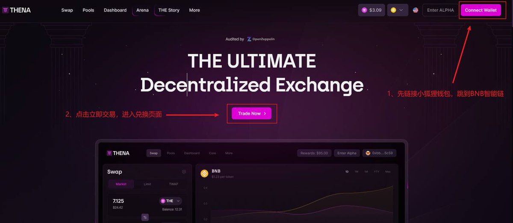
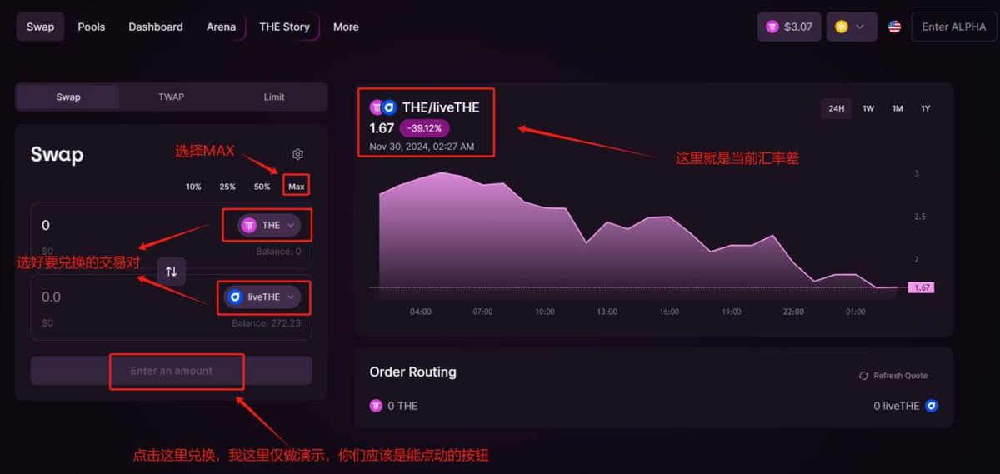

# $THE 代幣脫錨套利策略教學 — Ve(3,3) 模型與無風險收益

> **來源**: [@Joensmoon](https://x.com/Joensmoon/status/1863230443619054076)
>
> **日期**: Sun Dec 01 14:35:29 +0000 2024
>
> **標籤**: `套利機會` `脫錨交易對` `流動性質押`

---

> **來源**: [@Joensmoon](https://twitter.com/Joensmoon)
> **日期**: 2026-02-18
> **標籤**: `THE` `套利` `Ve(3,3)` `脫錨` `無風險收益` `BNB Chain`

---

## 背景說明

最近新上幣安的 $THE 代幣，從鏈上到現在已經上漲了幾十倍。這個專案採用 ve(3,3) 模型（類似 $VELODROME），共有三種代幣：

- **$THE**：正常買到的代幣
- **$livethe**：流動性質押憑證，相當於 stETH 這種
- **$vethe**：持幣可以享受交易所手續費分紅的代幣，有質押期限

## 脫錨原因

幣安上線該代幣後幣價拉了幾十倍，許多之前在 0.1/0.2 的價格就做質押的選手原地暴富。但因為他們的幣在鎖倉，收益無法變現，又害怕幣價以後會回撤，於是一窩蜂的把 $livethe 這個流動性質押憑證打 3 折就賣了。

雖然是打折賣，但因為成本價很低，依舊有十來倍的利潤。這個群體的行為導致：

- $THE 和 $livethe 的價格脫錨，$livethe 大幅貶值
- $THE/$livethe 交易對從常年 1 附近的匯率跌到最低 0.23（等於最高 1 個 $THE 可以換 4 個 $livethe）

## 官方回購機制

官方推特明確說明，每週都會用交易手續費回購 $livethe，讓價格匯率保持在 1 附近。只不過這次的脫錨程度比較大，很難快速的堵住這個窟窿。

除了官方回購，大家一起交易 $THE/$livethe 這個交易對，也是在助力錨定回歸。只要知道這個事情的人多了，套利做的多了，這個回購進程就會越來越快。

等到後面價格逐漸穩定，熱度過去，匯率回升是必然的事情。中間的匯率差值就是一段無風險的收益。

## 套利方案

### 方法一：對沖套利（無風險）

1. 幣安買 $THE 現貨
2. 一倍開空合約，把倉位鎖死
3. 去官網用 $THE 兌換更多的 $livethe
4. 等待匯率回到 1 附近，再兌換成更多的 $THE
5. 這部分多的 $THE 賣掉就是利潤

### 方法二：單邊套利（有價格風險）

1. 幣安買 $THE 現貨
2. 去官網用 $THE 兌換更多的 $livethe（相當於 1U 多買 $THE）
3. 等待匯率回到 1 附近，再兌換成更多的 $THE

**區別**：如果 $THE 後面漲價了，將會獲得更大的收益；但如果跌回 1U 多等於不賺錢。

## 套利實操步驟

1. **準備資金**
   - 從幣安購買少量 $BNB（約 3U 作為 gas）
   - 購買適量的 $THE
   - 將 $BNB 和 $THE 選擇 BEP20 提現到小狐狸錢包

2. **進入官網**
   - 連結小狐狸錢包
   - 點擊立即交易

3. **完成兌換**
   - 選擇 $THE/$livethe 交易對
   - 完成兌換即可
   - 匯率回歸再換回 $THE 時，只需要把買賣代幣種類換一下

## 注意事項

**不建議兌換 $vethe**：一旦把 $THE 或 $livethe 換成 $vethe，不鎖夠時間就想提現出來，本金是不會 1:1 返還的，原地虧。

## 套利邏輯總結

每個人的胃口都是有限的，當蛋糕夠大時，自然不介意和大家一起分享。你賺得了金錢，我賺得了人氣，還能加速錨定回歸，彼此三贏。

即使這個機會沒用上,這種套利思維也可以作為參考,應用到下個類似事件。
