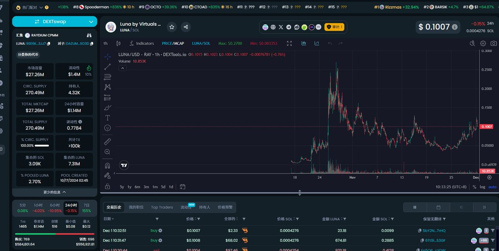
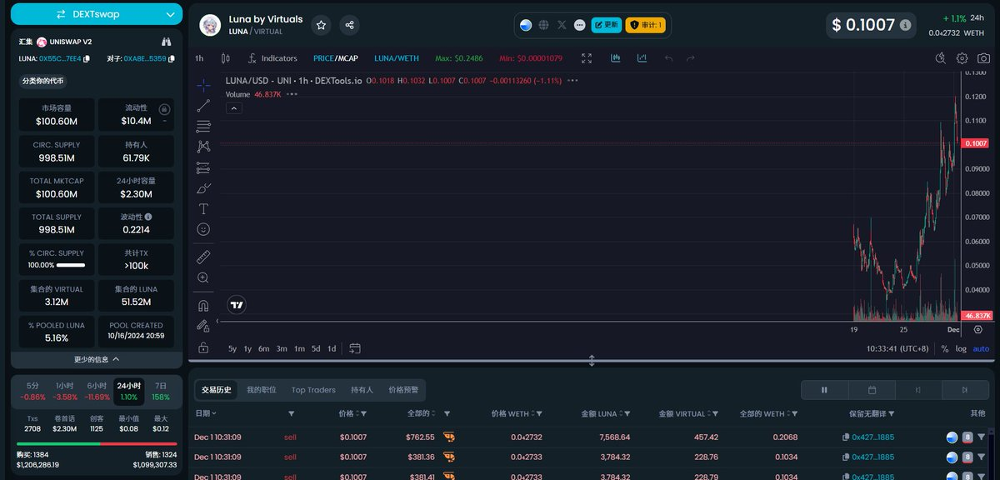
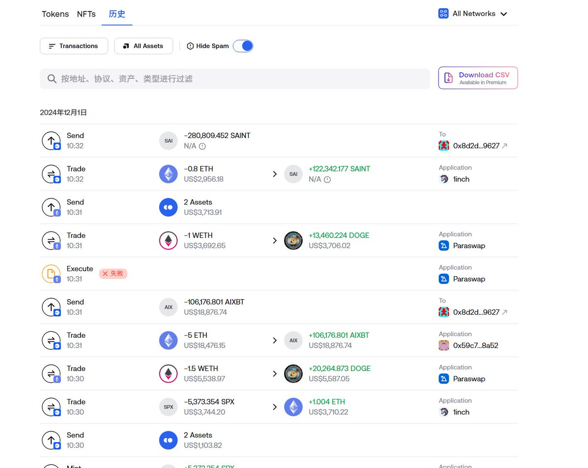

# 跨鏈搬磚套利策略——多鏈流動性差異機會

> **來源**: [@zhamomo666](https://x.com/zhamomo666/status/1863049663496258007)
>
> **日期**: Sun Dec 01 02:37:08 +0000 2024
>
> **標籤**: `跨鏈套利` `搬磚` `流動性`

---

> **來源**: [@zhamomo666](https://x.com/zhamomo666)  
> **日期**: 2026-02-18  
> **標籤**: `跨鏈套利` `鏈上搬磚` `流動性差異` `多鏈策略`

---

## 市場現況

目前市場跨鏈搬磚還是有點空間的。因為很多幣交易所沒有上線，但是各個鏈之間有很大池子。手動自動均可以搬磚。

## 實戰案例分析

**參考地址**：`0xca74f404e0c7bfa35b13b511097df966d5a65597`

### 搬磚路徑

- **BASE-SOL** 之間搬磚
- **ARB、BSC、ETH** 之間搬磚

### 收益估算

這個地址目測一天收益最少 5000U。

---

**備註**：作者表示會出影片詳細討論，可以先自行研究。
