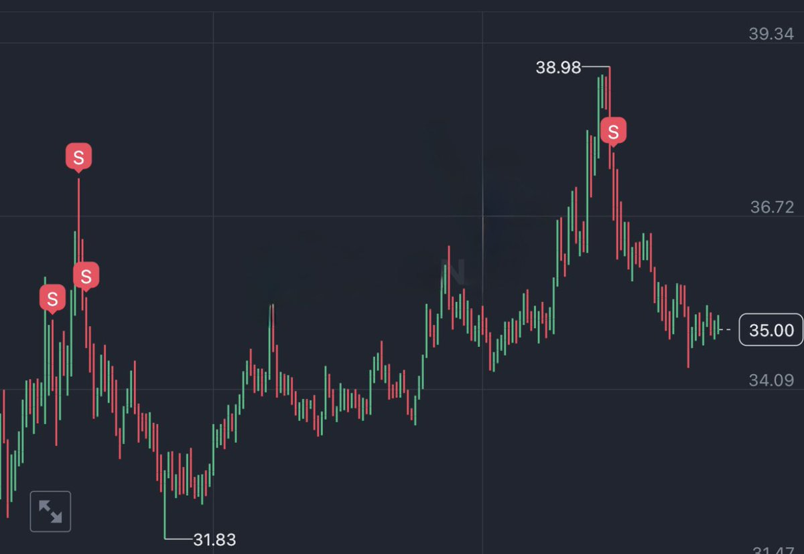
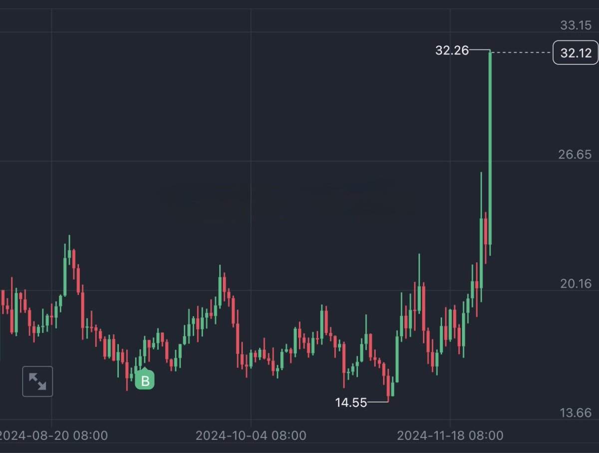

# 止盈技巧：分批止盈與止損管理

> **來源**: [@CycleStudies](https://x.com/CycleStudies/status/1862151884460757160) | [原文連結](https://twitter.com/CycleStudies/status/1862151884460757160/photo/1)
>
> **日期**: 
>
> **標籤**: `止盈策略` `風險管理` `交易紀律`

---

## 核心技巧

以 $ENS 為例，當價格進入預期止盈區域時：

### 正確操作流程

採取分批止盈策略，每次衝高即止盈部分倉位，同時逐步上移止損線，確保收益鎖定。

### 錯誤操作流程

猶豫觀望,想著再等等多賺一點，甚至在預期止盈位置逆勢加倉，導致風險增加。

## 關鍵原則

**脫離計劃就是風險！**

分批止盈配合動態止損線調整，是穩健鎖定利潤的重要手段。在預期止盈區域出現時，應嚴格執行既定計劃，避免因貪婪而錯失最佳退出時機。
