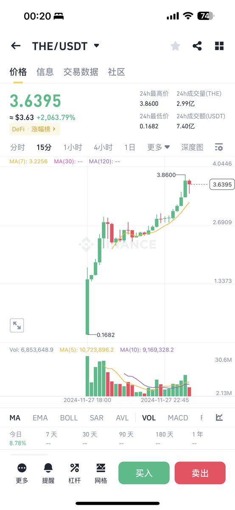
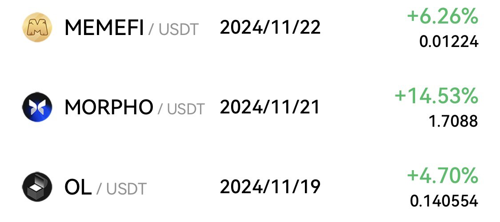
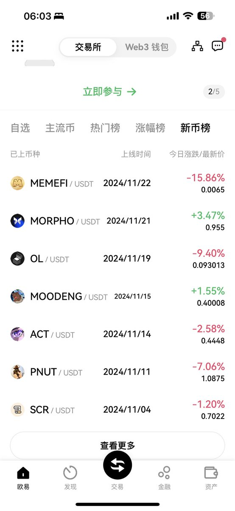

# 幣安 THE 與 OKX 三巨頭交易所拉盤策略對比

> **來源**: [@richrichardoz](https://x.com/richrichardoz/status/1861807926295593155) | [原文連結](https://twitter.com/richrichardoz/status/1861807926295593155/photo/1)
>
> **日期**: Wed Nov 27 16:22:55 +0000 2024
>
> **標籤**: `交易所競爭` `市場拉盤` `牛市策略`

---

> **來源**: [@richrichardoz (小Z)](https://twitter.com/richrichardoz)  
> **標籤**: `交易所策略` `拉盤` `Binance` `OKX`

---

## 核心觀點

幣安 $THE 與 OKX 三巨頭交易所在拉盤策略上的對比：交易所需要親自下場拉盤，否則即使在牛市中也會像熊市一樣表現低迷。

## 關鍵要點

- **交易所角色**：主流交易所（幣安、OKX）在代幣價格表現中扮演主動推動者角色
- **市場現象**：缺乏交易所支持的代幣，即使處於牛市環境，價格表現仍可能疲軟
- **策略差異**：不同交易所在拉盤策略上存在差異，影響上架代幣的價格走勢
