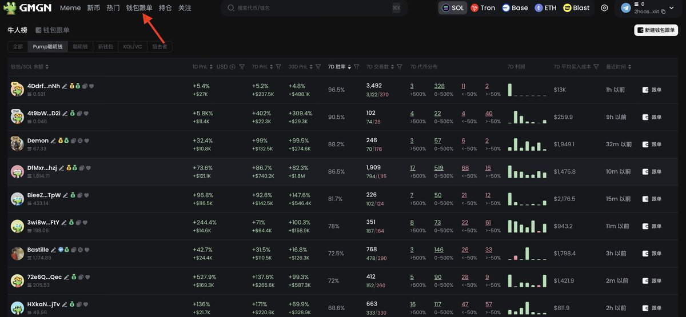

# 新手尋找聰明錢地址的基礎理論與實操指南

> **來源**: [@zhang_bj_](https://x.com/zhang_bj_/status/1860790754249154788) | [原文連結](https://x.com/zhang_bj_/status/1858822695208554973)
>
> **日期**: Sun Nov 24 21:01:02 +0000 2024
>
> **標籤**: `聰明錢跟蹤` `錢包分析` `風險識別`

---

> **來源**: [@zhang_bj_ (老张🤟与神对话)](https://x.com/zhang_bj_)
> **日期**: 2026-02-18
> **標籤**: `smart-money` `聰明錢追蹤` `地址篩選` `gmgn` `meme交易`

---

## 前言

現在衝 PVP Meme 要麼跟隨聰明錢地址，要麼自己用工具分析。現在看來有經驗專家的聰明錢地址可能來得更容易一些，身邊有幾個小伙伴靠跟蹤聰明錢地址買，已經持續賺了 1 年+ 的錢了。

## 聰明錢地址的來源途徑

### 1. 好友提供

前提是他找到的是準確的。這種需要滿足三個條件：

- 他是個好人
- 他很懂
- 他通過這個地址持續穩定地賺過錢

### 2. 網上公佈的

這個就要打一個大問號了，是不是有效的。

我一般不怎麼看，公佈的目的是什麼？要麼讓你跟割你，當然也可能是直播 space 時候就分享了。這種看到之後，還是要用第 4 種方法所講的分析方法分析一遍，看是不是符合你能跟的聰明錢屬性，再考慮開始跟。

### 3. 各個工具平台排行榜顯示的（問題很多）

這種問題是最多的，基本不用考慮了，排前面的大部分都是割你跟單的。後面具體會講解。

### 4. 自己用方法找到的（今天重點）

自己動手豐衣足食。當然目前，捕捉金狗常用的方法之一是掃鏈，建立自己的觀察列表。

對第一種捕捉金狗的方法還不了解的可以閱讀前面文章。

## 如何找到聰明錢地址

講解使用的工具還是 GMGN，網址：https://gmgn.ai

聰明錢包地址的方法肯定也有很多種，這裡講兩個常用的方法：

- 一個是**正著找**
- 一個是**反著找**

### 核心觀念

找的目的當然是賺錢，說一個核心觀念：

**找出來的聰明錢地址什麼樣是好的呢？交易頻率低，且營收金額高的。**

有了這個核心觀念，我們就可以開始尋找之旅。

先說正著找，當然筆者並不推薦使用正著找，因為問題諸多。

---

## 相關參考

如何使用掃鏈建立觀察列表的教學文章：[連結](https://t.co/NJqOK8gyQD)
