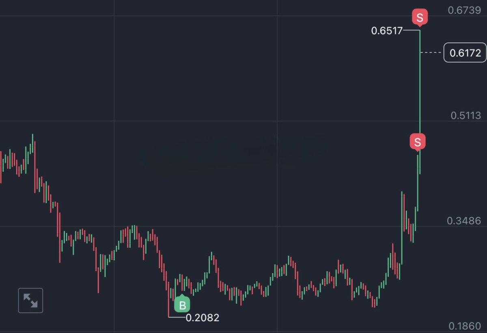

# 動態止盈止損策略：分批獲利與趨勢跟蹤

> **來源**: [@CycleStudies](https://x.com/CycleStudies/status/1860567089943314773)
>
> **日期**: Sun Nov 24 06:12:16 +0000 2024
>
> **標籤**: `止盈策略` `趨勢交易` `風險管理`

---

## 整理後內容

> **來源**: [@CycleStudies (百萬Eric | Day Trader)](https://twitter.com/CycleStudies)  
> **標籤**: `止盈策略` `倉位管理` `趨勢跟蹤` `技術分析`

---

## 暴漲行情下的倉位持有策略

當前暴漲的行情下,如果難以拿住倉位,可以採用如下策略,以 SAND 為例:

### 1. 分批止盈策略

每上漲 10%,止盈 = 當前持倉量 × 3%

假如買入價為 0.2082,上漲 10% 後價格約為 0.2290,此時止盈部分倉位,同時保留繼續上漲的機會。

### 2. 動態調整止損位

將止損設置在 EMA50 下方,隨著價格的上漲不斷提高止損位。

EMA50 作為趨勢參考,可以有效避免因短期波動而過早出局,同時保護利潤。
