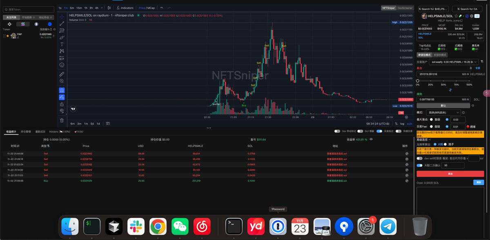
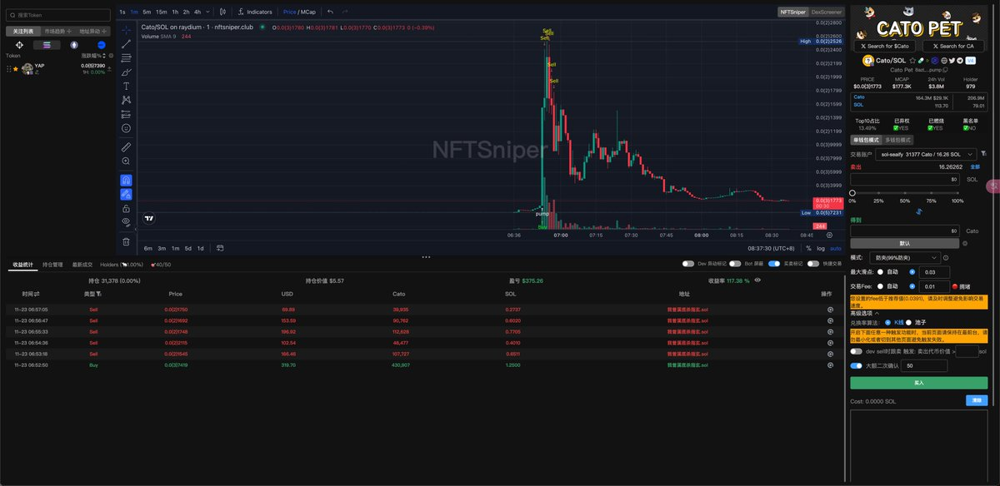
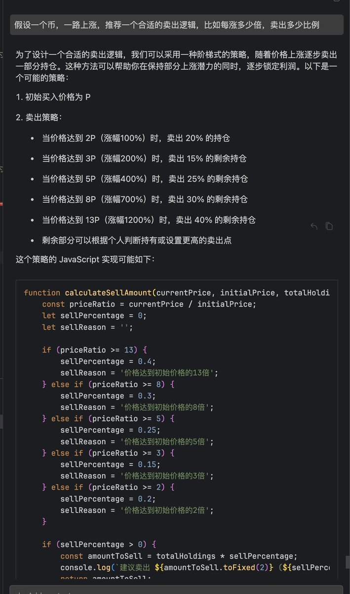

# 斐波那契數列止盈策略在 Solana 的應用

> **來源**: [@seaify1](https://x.com/seaify1/status/1860121923277254783)
>
> **日期**: Sat Nov 23 00:43:20 +0000 2024
>
> **標籤**: `止盈策略` `Solana 交易` `自動化交易`

---

> **來源**: [@seaify1](https://twitter.com/seaify1)
> **日期**: 2026-02-18
> **標籤**: `solana` `止盈策略` `斐波那契數列` `賣出策略` `kol跟單`

---

## 策略效果

修復了 bug，斐波那契數列止盈大法真的是太適合 Solana，昨天一天，至少有 2 個幣觸發了。

這種無視 KOL、無視 K 線等指標的無情大法，其實也有很大好處，介於紙手和鑽石手之間，防守和進攻都帶一些。

## 賣出策略設計

不過我的賣出策略裡，不止是斐波那契數列，同時還額外考慮了 KOL 的倉位比例變化。

賣出遠遠比買入重要，目前在 SOL 上的技術，其實是落後很多的，比如檢測到 KOL 買入，都已經過去了 3 秒，主要依賴的就是賣出策略。

## 實際案例

helpsmile，觸發了 2x、3x、5x、8x 止盈。

這個賣出策略，2 → 3 → 5 → 8 → 13，剛好還是斐波那契數列，看起來比翻倍出本設計得更好。

## 市場觀察

Solana 確實遠遠比暮氣沉沉的 ETH 好玩太多了。

之前本金 300 SOL，昨天只剩 11 SOL，目前 20 SOL，期待回本那天。
