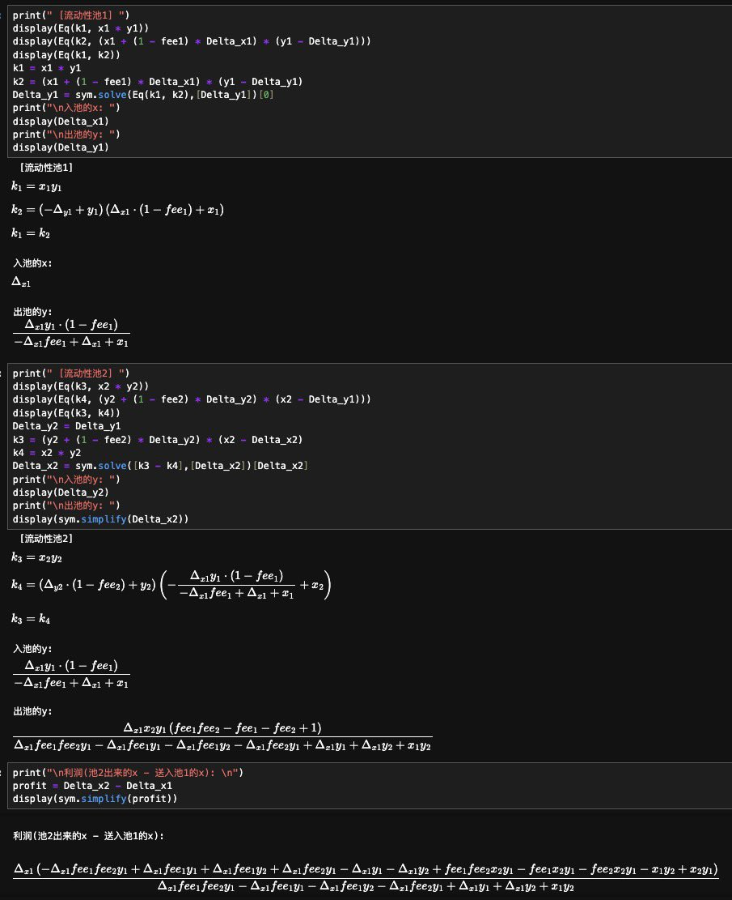
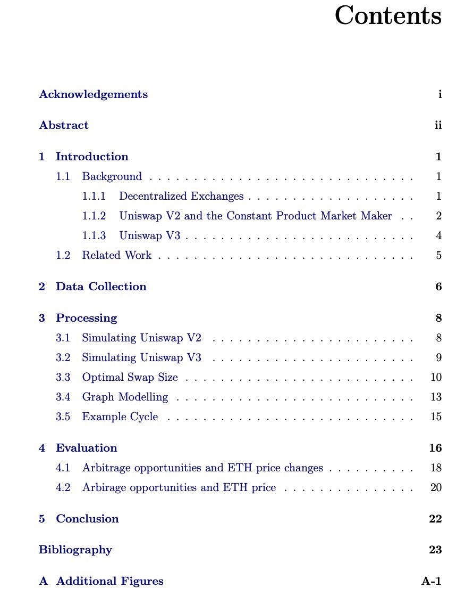
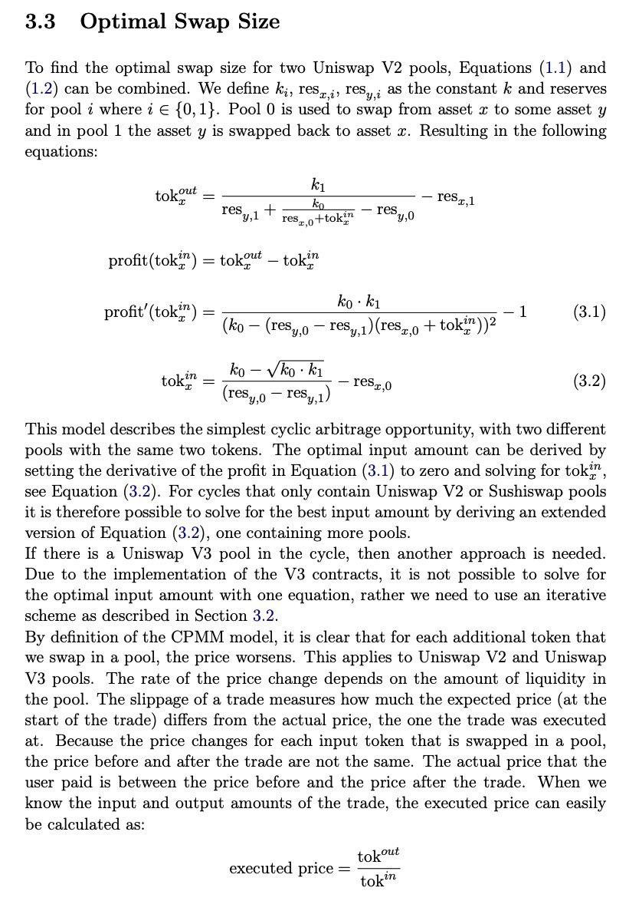

# MEV 套利公式推導─雙幣循環套利與三四角套利

> **來源**: [@BitDanceUp](https://x.com/BitDanceUp/status/1859195922783379875)
>
> **日期**: Wed Nov 20 11:23:44 +0000 2024
>
> **標籤**: `套利` `MEV` `公式推導`

---

> **來源**: [@BitDanceUp (ArBitCry)](https://twitter.com/BitDanceUp)
> **日期**: 2026-02-18
> **標籤**: `MEV` `套利` `公式推導` `Uniswap V2` `Python` `量化交易`

---

## 背景說明

這條套利推文的火熱程度超乎想像。知道真想做 MEV 套利的人想看什麼，我也曾這麼全網搜羅過。那就再多放一點點硬核乾貨：雙幣循環套利兩個池子利潤公式推導，基於 Uniswap V2 類型的流動池，使用 Python 實現。三角套利和四角套利同理。

這些內容很基礎，但很核心。我之前寫 bot 的時候就是這麼推導過的。

不用期待更多，不會有更多了，已經違背祖宗了🤣 可能對很多人來說，其實也足夠多了。

## 核心公式推導

### 雙幣循環套利（兩個池子）

針對 Uniswap V2 類型的流動性池，雙幣循環套利涉及兩個交易池之間的價差利用。推導過程基於恆定乘積做市商模型（Constant Product Market Maker, CPMM）：

**核心公式**：`x * y = k`

其中：
- `x` 和 `y` 分別代表池中兩種代幣的儲備量
- `k` 是常數

**套利利潤計算**需要考慮：
1. 兩個池子之間的價差
2. 交易手續費（通常為 0.3%）
3. 滑點影響
4. Gas 費用

### 推導邏輯

1. **識別價差**：比較兩個池子中同一交易對的價格
2. **計算最優交易量**：找到使利潤最大化的投入量
3. **扣除成本**：減去手續費和 Gas 費後的淨利潤

### 三角套利與四角套利

三角套利和四角套利的原理與雙幣循環套利相同，只是涉及的交易池數量不同：

- **三角套利**：涉及三個代幣和三個交易池（A→B→C→A）
- **四角套利**：涉及四個代幣和四個交易池（A→B→C→D→A）

公式推導邏輯一致，但計算複雜度隨著池子數量增加而提升。

## 實踐要點

套利是個技術活。從比特幣 2 萬美元的時候就在研究這些內容，到現在比特幣 9 萬美元了，還是在看這些內容。

好好地發現套利機會，用技術穩穩地賺錢。有細水長流的收益，才能淡定地看著市場火熱引發的各路神仙群魔亂舞的十倍百倍神話表演。

**靠自己的認知和技術賺的錢，不比從所謂「家人們」身上賺的錢更香嗎？**

## 技術實現

使用 Python 進行公式推導和 bot 開發，基於 Uniswap V2 的流動性池模型。核心在於：

1. 實時監控多個池子的價格
2. 快速計算套利機會
3. 自動執行交易（考慮 Gas 費優化）
4. 風險控制（滑點、失敗回滾等）
