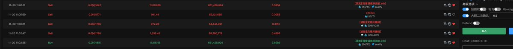

# 搬磚機器人套利策略：鏈上現貨與交易所價差自動化

> **來源**: [@seaify1](https://x.com/seaify1/status/1859080780909015314) | [原文連結](https://twitter.com/seaify1/status/1859080780909015314/photo/1)
>
> **日期**: Wed Nov 20 03:46:12 +0000 2024
>
> **標籤**: `套利機器人` `價差交易` `交易所策略`

---

## 搬磚機器人套利策略發現

作者在交易過程中發現一個有趣的現象：每當買入某種幣後，總是會被立刻砸盤。經過查證後才發現，對方是搬磚機器人。

## 機器人運作機制

### 基本策略

機器人會在鏈上準備著各種幣的現貨，持續監控與交易所的價差：

1. **發現價差**：當鏈上價格高於交易所時
2. **立即砸盤**：秒速賣出鏈上持有的幣
3. **補充庫存**：砸完後如果還有價差，緊急從 Gate 等交易所調貨
4. **重複套利**：補貨後繼續砸盤

### 套利要點

- **鏈上現貨準備**：提前在鏈上持有多種幣，無需等待跨鏈轉帳時間
- **價差監控**：實時比對鏈上價格與中心化交易所（CEX）價格
- **快速執行**：發現價差立即砸盤，速度是關鍵
- **動態補貨**：根據套利機會從交易所調貨，保持鏈上庫存

## 策略特點

這是一個典型的跨平台價差套利（搬磚）策略，利用去中心化交易所（DEX）與中心化交易所（CEX）之間的價格差異獲利。機器人透過提前準備鏈上現貨庫存，大幅縮短反應時間，提高套利成功率。
