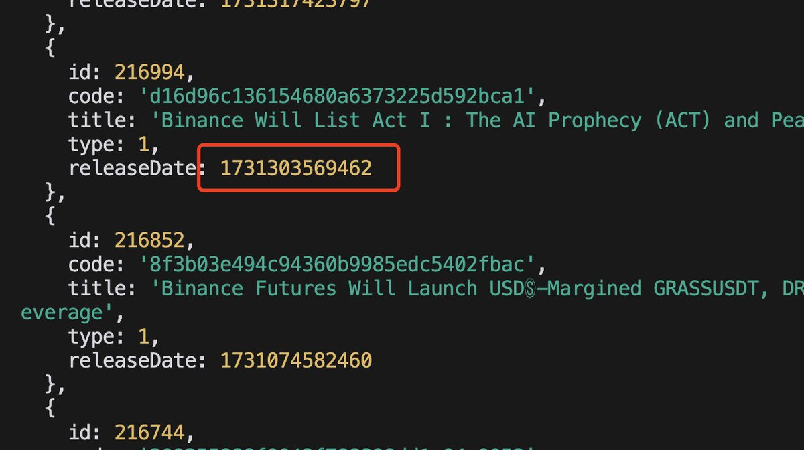
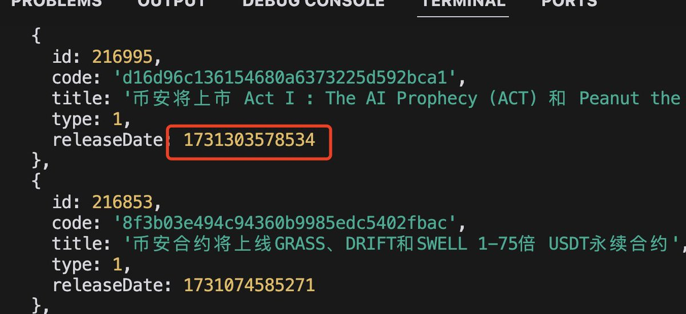
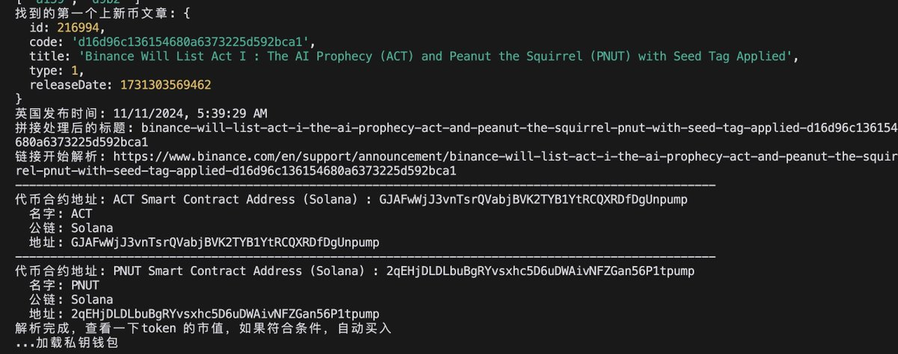

# Freqtrade：免費開源加密貨幣交易機器人

> **來源**: [@vikingmute](https://x.com/vikingmute/status/1858426188672455050) | [原文連結](https://github.com/freqtrade/freqtrade)
>
> **日期**: Mon Nov 18 08:25:05 +0000 2024
>
> **標籤**: `交易機器人` `Python` `自動化交易`

---






> **來源**: [@vikingmute (Viking)](https://twitter.com/vikingmute)  
> **日期**: 2024-11-11  
> **標籤**: `交易機器人` `開源工具` `加密貨幣` `Python` `量化交易`

---

## 專案簡介

Freqtrade 是一個免費開源的加密貨幣交易機器人，使用 Python 編寫。它支援所有主流交易所，可透過 Telegram 或 Web UI 控制。包含回測、繪圖、資金管理工具，以及透過機器學習進行策略優化的功能。

**GitHub 專案**: [freqtrade/freqtrade](https://github.com/freqtrade/freqtrade)  
**官方網站**: [www.freqtrade.io](https://www.freqtrade.io)  
**Stars**: 近 30k（現已達 46.9k）

## 核心功能特色

### 基礎功能
- **跨平台支援**：基於 Python 3.11+，可在 Windows、macOS、Linux 運行
- **資料持久化**：透過 sqlite 儲存交易資料
- **Dry-run 模式**：模擬交易，不需實際投入資金
- **回測功能**：使用歷史資料模擬買賣策略
- **機器學習優化**：透過機器學習優化策略參數

### 進階功能
- **FreqAI 自適應預測**：使用自適應機器學習方法建立智慧策略
- **動態白名單/黑名單**：選擇或排除特定加密貨幣
- **內建 Web UI**：網頁介面管理機器人
- **Telegram 整合**：透過 Telegram 管理與監控
- **法幣損益顯示**：以法定貨幣顯示盈虧
- **績效報告**：提供當前交易的績效狀態

## 支援的交易所

### 現貨交易
- Binance
- BingX
- Bitget
- Bitmart
- Bybit
- Gate.io
- HTX
- Hyperliquid（去中心化交易所）
- Kraken
- OKX / MyOKX
- 以及許多其他交易所

### 合約交易（槓桿交易）
- Binance
- Bitget
- Gate.io
- Hyperliquid
- OKX
- Bybit

**社群測試通過**：Bitvavo、Kucoin

## 技術架構

### 系統需求

**最低硬件配置**：
- 2GB RAM
- 1GB 磁碟空間
- 2 vCPU

**軟體需求**：
- Python >= 3.11
- pip
- git
- TA-Lib
- virtualenv（推薦）
- Docker（推薦）

**重要**：系統時鐘必須精確，需頻繁與 NTP 伺服器同步，以避免與交易所通訊時出現問題。

### 主要分支

- **develop**：開發分支，包含最新功能，但可能有重大變更
- **stable**：穩定版本分支，經過充分測試
- **feat/***：功能分支，正在積極開發中

## 基本使用

### 快速啟動

推薦使用 Docker 快速啟動（詳見官方文檔的 Docker Quickstart）。

### 指令列工具

```bash
freqtrade [-h] [-V] {trade,create-userdir,new-config,show-config,...}
```

**主要指令**：
- `trade`：交易模組
- `create-userdir`：建立使用者資料目錄
- `new-config`：建立新設定檔
- `new-strategy`：建立新策略
- `download-data`：下載回測資料
- `backtesting`：回測模組
- `hyperopt`：超參數優化
- `list-exchanges`：列出可用交易所
- `list-strategies`：列出可用策略
- `webserver`：啟動 Web 伺服器
- `plot-dataframe`：繪製 K 線與指標
- `plot-profit`：繪製獲利圖表

### Telegram 指令

- `/start`：啟動交易機器人
- `/stop`：停止交易機器人
- `/stopentry`：停止開新倉位
- `/status [trade_id]`：列出所有或特定開倉
- `/profit [n]`：顯示過去 n 天的累計獲利
- `/profit_long [n]`：顯示多單累計獲利
- `/profit_short [n]`：顯示空單累計獲利
- `/forceexit <trade_id>|all`：強制平倉（忽略 minimum_roi）
- `/performance`：顯示每個交易對的績效
- `/balance`：顯示帳戶餘額
- `/daily <n>`：顯示過去 n 天的每日損益
- `/help`：顯示幫助訊息
- `/version`：顯示版本資訊

## 免責聲明

本軟體僅供教育用途。請勿拿無法承受損失的資金進行交易。使用本軟體的風險由使用者自行承擔。作者及所有關聯方對您的交易結果不承擔任何責任。

建議：
- 始終先在 Dry-Run 模式下運行
- 在投入真實資金前，務必了解機器人的運作方式及預期盈虧
- 強烈建議具備編程和 Python 知識
- 閱讀原始碼並理解機器人的運作機制

## 社群與支援

- **Discord**：加入 Freqtrade Discord 伺服器討論與交流
- **GitHub Issues**：回報 bug 或提出功能請求（使用 issue tracker）
- **Pull Requests**：歡迎貢獻程式碼（請先閱讀 Contributing 文件）
- **文件**：完整文件請參考官方網站

## 使用場景與建議

★ Insight ─────────────────────────────────────

**來自社群的實務觀點**：
- 原推文作者提到此工具適合想要自動化交易但不想從頭寫程式的使用者
- 支援 Dry-run 模式是重要特性，可在不投入真實資金的情況下測試策略
- 近 30k（現 46.9k）的 GitHub stars 顯示社群活躍且專案成熟度高
- 作者本人不炒幣，但推薦此工具作為學習交易機器人的起點

**套利場景相關性**：
- 原推文討論背景涉及交易所公告的時間差（英文公告比中文快 9 秒）
- 這類時間差在高頻交易中可能產生套利機會
- Freqtrade 提供的策略優化與回測功能可用於驗證此類套利策略的可行性

─────────────────────────────────────────────────
