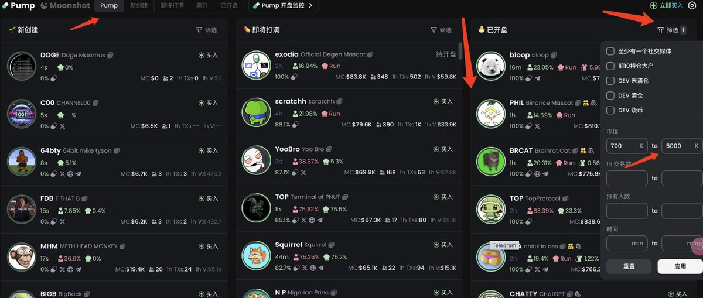

# 低市值代幣篩選策略：70-500 萬市值的高角度機會

> **來源**: [@cishanjia](https://x.com/cishanjia/status/1857299158090338665) | [原文連結](https://twitter.com/cryptocishanjia/status/1857299158090338665/photo/1)
>
> **日期**: Fri Nov 15 05:46:40 +0000 2024
>
> **標籤**: `代幣篩選` `市值策略` `風險管理`

---

> **來源**: [@cishanjia (慈善家)](https://x.com/cishanjia)
> **標籤**: `Solana` `低市值代幣` `篩選策略` `市值區間`

---

## 市值區間策略調整

之前的想法是只玩篩選 Solana 上 2000 萬市值左右的代幣就好，後來玩了幾次發現 2000 萬市值代幣其實也很容易往下雪崩。

前幾天看到有個博主說人家在 Solana 上篩選 **70-500 萬市值的代幣**，每天都過幾遍，**專門找有大角度的**。

## 實踐心得

奶子哥用這個方法半個月了，最後感悟是：

- **還是要勤奮**
- **多看**
- **少動**
- **想明白自己的投資策略**
