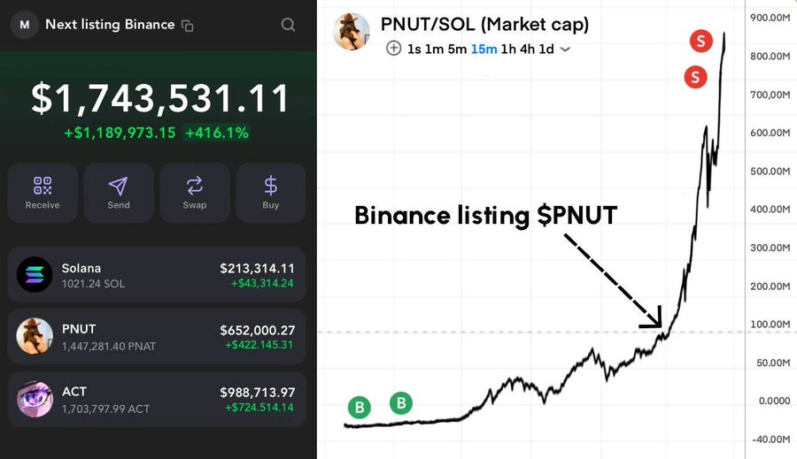

# 幣安Meme季來臨：大幣種潛力與上線預期分析

> **來源**: [@sol_jingou](https://x.com/sol_jingou/status/1856859452764557568) | [原文連結](https://twitter.com/sol_jingou/status/1856859452764557568/photo/1)
>
> **日期**: 
>
> **標籤**: `Meme幣` `幣安上線` `潛力項目`

---

> **來源**: [@sol_jingou (阿布说币)](https://x.com/sol_jingou)
> **日期**: 2026-02-18
> **標籤**: `meme-coin` `幣安上線` `牛市策略` `代幣預測`

---

## 幣安 Meme 季歷史表現

幣安即將拉開有史以來最大的 meme 季的序幕！

過往幣安上線 meme 幣後的漲幅表現：

| 代幣 | 漲幅表現 |
|------|----------|
| #NEIROCTO | $17M → $1B（50x） |
| #ACT | $20M → $500M（25x） |
| #PNUT | 20x |

## 接下來幣安最可能上線的 6 個 Memecoins

作者挖掘了數千枚代幣後，整理出接下來幣安最可能上線的 6 個 meme 幣候選名單。

（註：原文提到有圖片連結，但未提供具體的 6 個代幣名稱清單）
