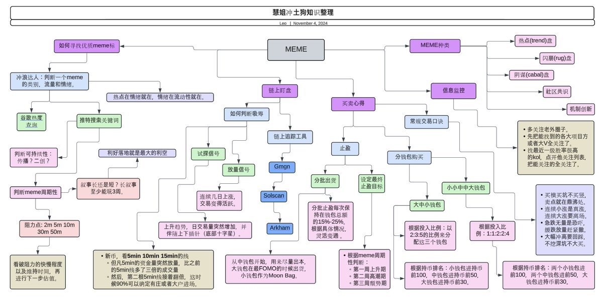

# 一級市場 KOL 指南與思維導圖整理

> **來源**: [@leo_0s1](https://x.com/leo_0s1/status/1855479320942104772)
>
> **日期**: Sun Nov 10 05:15:17 +0000 2024
>
> **標籤**: `一級市場` `KOL推薦` `知識管理`

---

> **來源**: [@leo_0s1 (玖年🌿🌿🌿)](https://x.com/leo_0s1)
> **日期**: 2026-02-18
> **標籤**: `一級市場` `KOL` `加密貨幣` `投資學習`

---

## 推薦關注的一級市場博主

以下是一系列值得關注的幹貨博主，作者計劃在之後閱讀他們的亮點內容：

- [@Wilsonchen1101](https://x.com/Wilsonchen1101)
- [@Stoiiic](https://x.com/Stoiiic)
- [@thecryptoskanda](https://x.com/thecryptoskanda)
- [@Michael_Liu93](https://x.com/Michael_Liu93)
- [@timotimoqi](https://x.com/timotimoqi)

這些博主都是作者認為很有水平的，建議尚未關注的可以關注。此外，作者表示如果思維導圖完成了，也會在之後發出來。

## 一級市場經驗分享整理

作者之前在看 [@0xmagnolia](https://x.com/0xmagnolia) 一級市場的一些經驗分享時，邊看邊把這些知識整理成思維導圖以加強自己的理解。

### 整理說明

- 作者採用了非常主觀的方式去整理所看的內容，因此可能沒有原版那麼全
- 想看完整版的可以參考 [@xixikawaii](https://x.com/xixikawaii) 的推文
- 如果有好的一級市場長文，歡迎在評論區分享，作者會挑選一些整理並做成導圖
