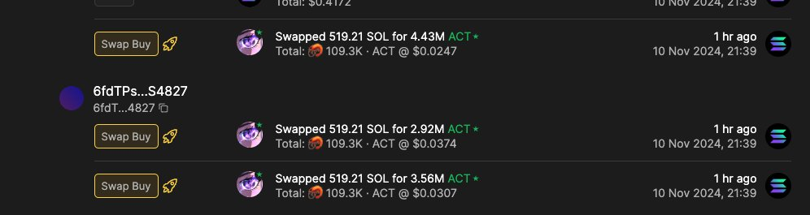
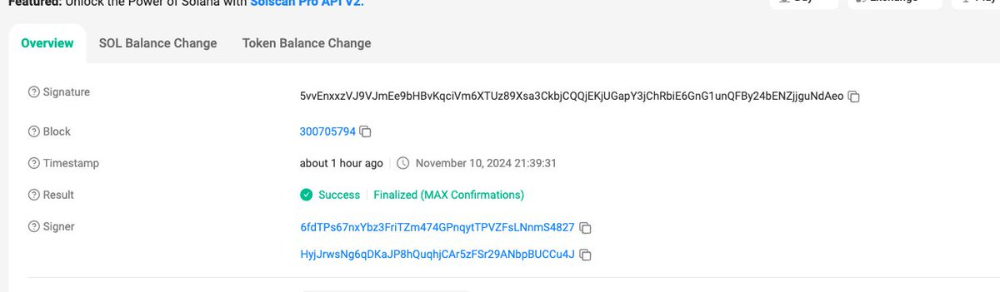
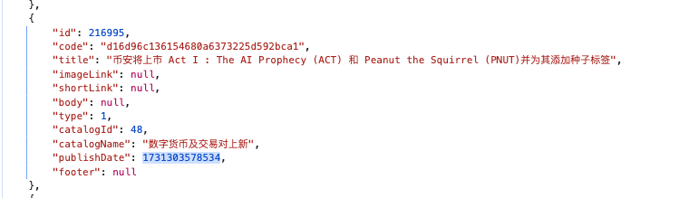

# ACT 代幣幣安上線內幕交易分析 — 7 秒領先公告

> **來源**: [@JeffroBTC](https://x.com/JeffroBTC/status/1855867227834372170)
>
> **日期**: Mon Nov 11 06:56:42 +0000 2024
>
> **標籤**: `內幕交易` `市場微觀結構` `信息不對稱`

---

> **來源**: [@JeffroBTC (Jeffro)](https://x.com/JeffroBTC)
> **日期**: 2024-11-10
> **標籤**: `ACT` `幣安` `內幕交易` `鏈上分析` `Solana`

---

我嚴重懷疑這個事是內幕哇！😭今晚幣安公告上線 $ACT，幣價瞬間飆升 10 倍+

## 可疑交易分析

我們看這個地址：`6fdTPs67nxYbz3FriTZm474GPnqytTPVZFsLNnmS4827`

他在美西時間 21:39 連續買入三筆，共計約 1500 SOL 的 $ACT。

## 時間軸對比

我們到 Solscan 看他第一筆交易的準確時間是：**November 10, 2024 21:39:31**

而幣安公告的精確時間是時間戳 `1731303578534`，這個時間轉化為美西時間為 **2024-11-10 21:39:38**

## 結論

也就是咱先不考慮他準備資金的時間，這個人買入比幣安公告還快了 **7 秒**！

麻了😖
