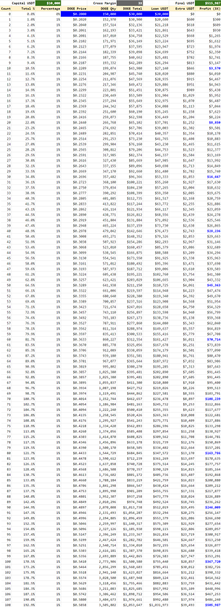

# 狗狗幣槓桿滾倉策略：單邊行情的收益最大化

> **來源**: [@_0xKenny](https://x.com/_0xKenny/status/1855075620189094059)
>
> **日期**: Sat Nov 09 02:31:08 +0000 2024
>
> **標籤**: `槓桿交易` `滾倉策略` `幣安現貨`

---

> **來源**: [@_0xKenny (Kenny.eth)](https://twitter.com/_0xKenny)
> **日期**: 2026-02-18
> **標籤**: `槓桿交易` `滾倉策略` `DOGE` `風險管理`

---

## 策略概述

在確定性單邊行情中，如何最大化收益?以狗狗幣 $DOGE 為例，假設未來幾個月市場持續走高，狗狗幣在沒有超過 33% 回撤的前提下，從目前 $0.20 回到前高 $0.58（上漲 +190%）。

## 策略參數設置

**基礎配置：**
- 交易所：Binance
- 模式：Cross 全倉模式
- 槓桿倍數：3X Leverage
- 初始資金：$10,000 USDT

## 操作流程

1. **初始建倉**：將本金加上 3X 槓桿借貸出來的 USDT 全部買入 $DOGE

2. **滾倉規則**：
   - 價格每上漲 1%，執行滾倉動作
   - 將額外增加的借貸額度全部買入 $DOGE
   - 價格下跌時不做任何動作

## 收益對比分析

| 策略類型 | 最終利潤 | 收益倍數 |
|---------|---------|---------|
| 3X 槓桿 + 滾倉 | $505K | 50X |
| 3X 槓桿（無滾倉）| $78K | 7.8X |
| 現貨 Buy & Hold | $18K | 1.8X |
| 2.5X 槓桿 + 滾倉 | $134K | 13.4X |

## 風險控制建議

**保守方案**：可降低槓桿至 2.5X（容忍回撤不超過 40%），在價格突破前高時，最終利潤為 $134K，13.4X。

**關鍵風險點**：
- 回撤超過 33%（3X 槓桿）或 40%（2.5X 槓桿）時可能觸發強平
- 策略僅適用於單邊上漲行情
- 震盪行情可能導致虧損

---

★ Insight ─────────────────────────────────────
- **滾倉策略的核心**：透過價格上漲時不斷增加槓桿借貸額度，實現複利效果，將 3X 槓桿的 7.8X 收益提升至 50X
- **風險與回報的平衡**：3X 槓桿容忍 33% 回撤，2.5X 槓桿容忍 40% 回撤，降低槓桿倍數可提高策略穩定性但犧牲部分收益
- **單邊行情適用性**：此策略僅適合對行情有高度確定性的場景，震盪市場會因頻繁觸發滾倉而增加成本與風險
─────────────────────────────────────────────────

**【僅為策略分析，不構成投資建議】**
