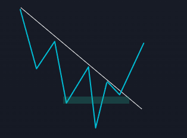

# 回測系統：集中於最賺錢的單一模式

> **來源**: [@winchrr](https://x.com/winchrr/status/1852658155450159386) | [原文連結](https://twitter.com/winchrr/status/1852658155450159386/photo/1)
>
> **日期**: Sat Nov 02 10:24:59 +0000 2024
>
> **標籤**: `回測` `交易系統` `模式識別`

---

> **來源**: [@winchrr (Kotasan)](https://twitter.com/winchrr)
> **標籤**: `backtesting` `trading-pattern` `pareto-principle` `strategy-optimization`

---

## 核心發現

回測了一下自己的系統，發現 80% 的盈利單都是靠這一個模式。

也許我不應該繼續研究剩下的 99 種模式了。

---

## 啟示

這是典型的帕累托法則（80/20 法則）在交易系統中的體現：少數幾個核心模式貢獻了絕大部分的獲利。與其分散精力研究大量邊緣策略，不如專注優化最有效的單一模式。
