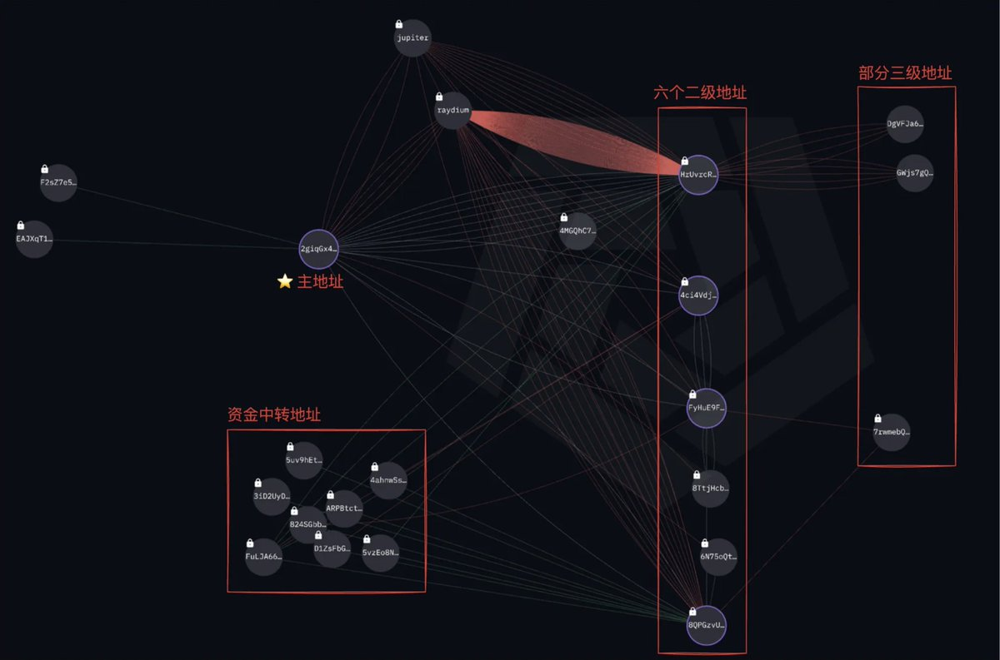
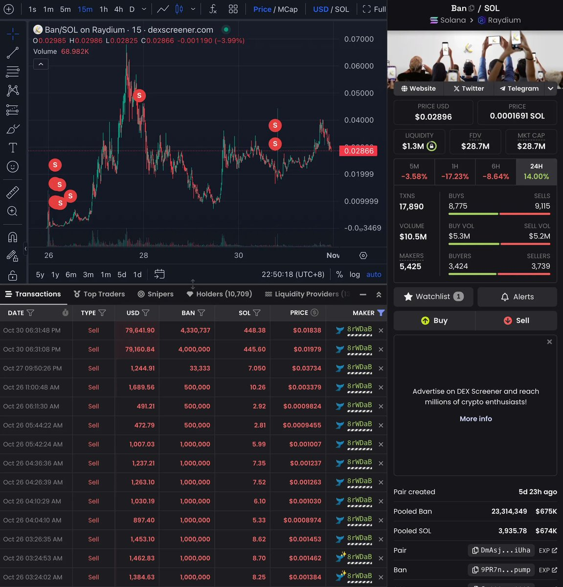

# BAN 迷因幣鯨魚操縱分析：627 倍報酬的財富轉移

> **來源**: [@ai_9684xtpa](https://x.com/ai_9684xtpa/status/1852237477094002747) | [原文連結](https://pump.fun/)
>
> **日期**: Fri Nov 01 06:33:22 +0000 2024
>
> **標籤**: `鯨魚操縱` `迷因幣交易` `鏈上分析`

---




> **來源**: [@ai_9684xtpa (Ai 姨)](https://x.com/ai_9684xtpa)
> **日期**: 2025-01-31
> **標籤**: `Solana` `Meme幣` `鯨魚分析` `內幕交易` `鏈上分析`

---

## 事件概述

昨天 Solana Meme 代幣 $BAN 暴力反彈 60%，市值一度回到 4000 萬美金。

而疑似陰謀集團/老鼠倉地址 `2giqG…MLGZT` 也終於在昨天完成了所有代幣拋售，他一度持有總量 9.2% 的代幣，僅憑 903 美金獲利 56.7 萬美金，回報率高達 627 倍 👻

## 財富轉移操作手法

看看你的「PVP 對象」到底是如何一步步完成財富轉移的：

### 操作時間線

1. **主地址在 Pump.fun 內盤階段**花費 5.09 SOL（903 美金）買入 9220 萬枚 $BAN（佔代幣總量的 9.2%）

2. **主地址在上漲過程中**賣出 3410 萬枚 BAN，獲利 330.2 SOL

3. **主地址將 5875 萬枚 BAN** 分發至六個二級地址

4. **二級地址將少量代幣**派發至三級地址拋售，且二級地址間頻繁有代幣進出

5. **三級地址在代幣暴漲過程中**偽裝為散戶地址分批賣出

## 資金流轉分析

總計 21 個地址的資金流轉情況，其中地址 `8QPGz…rWDaB` 為主要操作地址。根據 DEXScreener 賣出點位圖可以看到：

### 拋售策略特點

🔹 **第一波上漲**：選擇了「分批小額拋售」，以便在熱度最高時不要吸引過多注意

🔸 **因蘇富比副總裁消息暴跌 90% 時**：沒有過任何一次賣出動作

🔹 **第二波反彈**：選擇了兩筆大額賣出，市值近 2 千萬刀處快速清倉了所有代幣

🔸 **其他關聯地址**：也陸續在 30 號晚上或 31 號上午完成了拋售

## 相關地址

**主地址**：
```
2giqGx48fcYrnJBWFd78g358MRMHTkGLW35onb7MLGZT
```

**六個主要二級地址**：
```
8QPGzvUVpKx2GgWGP9DG5TkYESon9bGW5d32mr8rWDaB（主操作地址）
6N75oQtec7fywBrjPvxhpReCrV1pgAoBUuX2zyKPrsMy
8TtjHcbUdrXzoe1XoUvewuYKPSwD522thYE3XFYqJMta
4ci4VdjtNsMAWs9GiutHF43hkfqLbYK4rd8UUdyAKVtf
FyHuE9FcLdv38szj6pE4haSgc2CucEZ3AucPFZsHD49c
HrUvrcRSNn9hZP6rXHnncxGw11k5dMtLxrsfFePUKmbA
```
