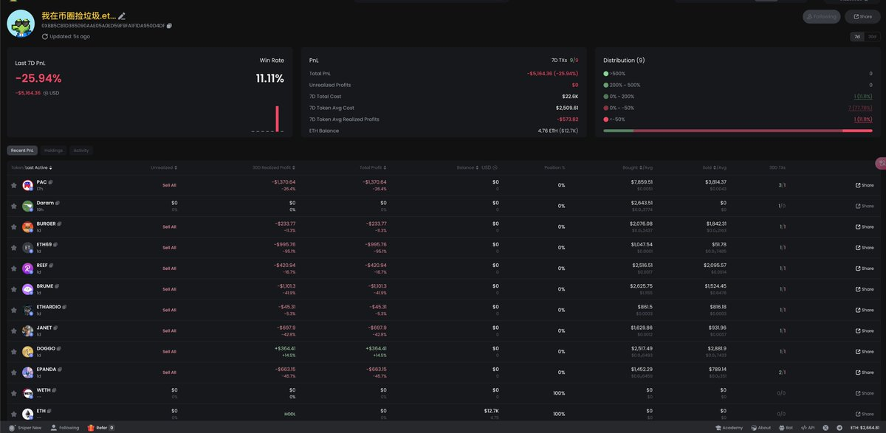
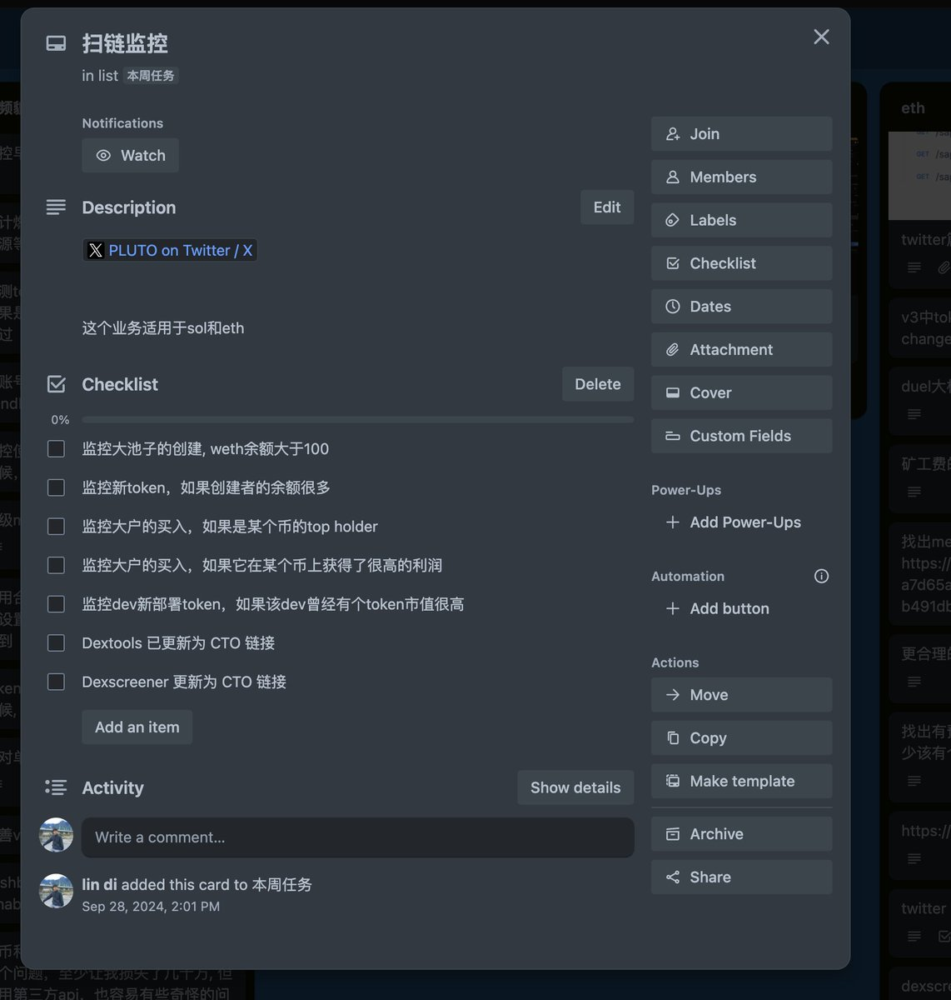

# 十月月末交易總結：風控升級與策略優化

> **來源**: [@seaify1](https://x.com/seaify1/status/1851794765777662090)
>
> **日期**: 
>
> **標籤**: `風險管理` `交易日誌` `策略迭代`

---

> **來源**: [@seaify1](https://twitter.com/seaify1)
> **日期**: 2024-10-31
> **標籤**: `交易總結` `風險管理` `策略優化` `MEV`

---

## 月度交易回顧

國慶的時候，還記得晚上打麻將，贏了一把的間歇，打開手機瞅一眼，不少群友給我發訊息，說上貔貅了，頭皮發麻，趕緊打開 abot 看了下，大概虧損 1.5 萬刀，一方面心疼，一方面幸好沒被掏乾淨，不在電腦面前，只能保持關注，繼續麻將，最後麻將贏 300，也感謝各位群友的關心，感受到了溫暖。

天崩開局，國慶 7 天虧損了 32 E，後來 V 神砸盤，Trump 75 E 接針，把損失弄回來了，可惜後面半個月基本都是 SOL 上了，ETH 狗都不玩了，最終本月盈利大概 20 E。

## 重要進展

這個月，做了一些很有意義的事情：

### 1. 風控強化
增強了風控，沒有再出現國慶期間的被釣魚事件。

### 2. 出貨策略改進
學會了分批出貨，不再是一次性砸盤。

### 3. 鑽石手策略
針對部分幣種，學會了盈利後轉鑽石手帳號，當彩票，賭個未來。

### 4. 撿垃圾邏輯
加上了撿垃圾的邏輯，虧錢中，原來我撿的真的都是垃圾。

### 5. 推特數據整合
加上了推特的部分支持，會檢測項目方的推特粉絲數量，還有和我關注的人的交集等。

### 6. MEV 研究
學習了不少好的 MEV 思路和代碼，但是沒有親自實踐，沒有吃透，而且短時間不再準備介入 MEV 了，但是會多做儲備。

## 下月計劃

下個月，會多做一些鏈上數據分析的工作，還有 Etherscan 的 label 標籤的使用，另外還有 2 位鑽石手的推文分析，最理想的情況，還是要找出一個列表，潛在的金狗，有社區的。MEV 套利路線，盈利太有限了，還是想嘗試下炒幣，方向是否歪了，倒是要以後長時間來驗證了。
