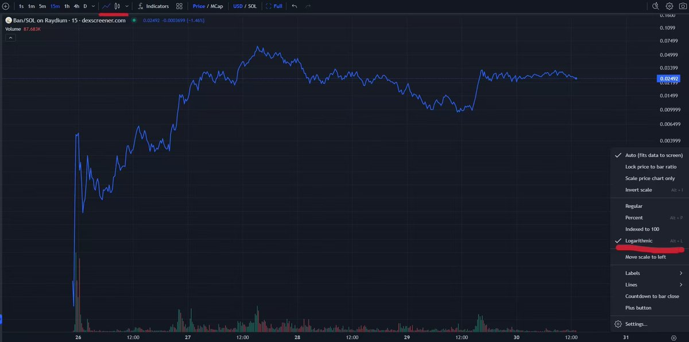
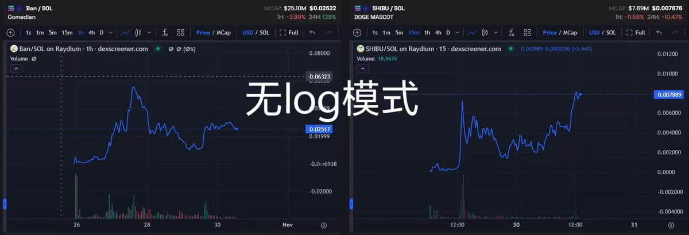
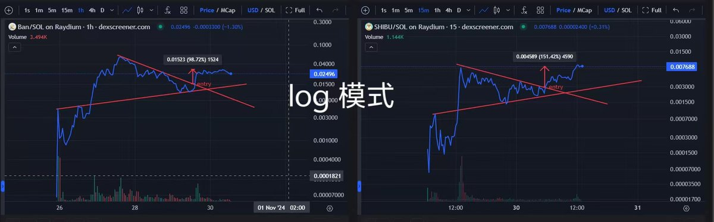

# 土狗幣二次進場策略：用 GMGN 找出回調買點

> **來源**: [@shiluxiya](https://x.com/shiluxiya/status/1851503000914948158) | [原文連結](https://gmgn.ai/?ref=FAMt6Zaz&chain=sol)
>
> **日期**: Wed Oct 30 05:54:49 +0000 2024
>
> **標籤**: `土狗交易` `K線分析` `GMGN工具`

---

> **來源**: [@shiluxiya (是露西呀)](https://twitter.com/shiluxiya)
> **日期**: 2024-XX-XX
> **標籤**: `meme-coin` `gmgn` `二級市場` `技術分析` `入場策略`

---

## 核心策略

如果你沒有科技優勢搶到起點，也沒有運氣衝到金狗起點，就去選擇明牌的、回調較大的金狗去做二次入場吃波段。

選擇標準：
- 火過的幣種
- 有名人持續站台
- 這種幣通常不至於跌一波就死透

範例：蘇富比明牌的 $BAN、狗媽明牌的 $SHIBU

## 用 GMGN 找二次進場點

### 第一步：切換到線型圖

點擊左上角，把 K 線從蠟燭圖調成**線型圖**。

**原因**：土狗流動性不好，做市不成熟，很多單 K 波動只是幾個大交易的影響而已，屬於隨機遊走，沒有什麼參考價值。不需要像成熟二級市場一樣觀察 K 線細節，反而需要用線型圖過濾噪音。

### 第二步：開啟 Log 模式

點擊右下角，選擇 **log 模式（logarithmic）**。

**原因**：土狗波動非常大，經常跌幅八九十。如果不用 log，你會覺得它已經跌死了，而且不好識別型態。但用了 log，你會發現它仍然是非常健康的走勢。

## 實戰案例分析

### $BAN 和 $SHIBU 的共同特徵

在不用 log 的情況下，很難發現它們有什麼共性。但用了 log 之後，你會發現：

- **哪怕跌幅 80%+**，在 log 圖上仍然是很健康的回調
- 都是一樣的非常簡單的浪型結構：**回踩前高，突破下跌趨勢線後再次上漲**

## 操作建議

用這種方法結合一些 K 線基礎知識，選好標的，就很容易抓到土狗二次進場點。

---

**GMGN 平臺功能提示**：
- CA 安全檢查：LP burned、Honeypot、Renounced、Mintable
- 監控內線交易者、狙擊手和前 70 名買家的持倉
- 新幣 FOMO 提醒
- 跟單聰明錢功能
