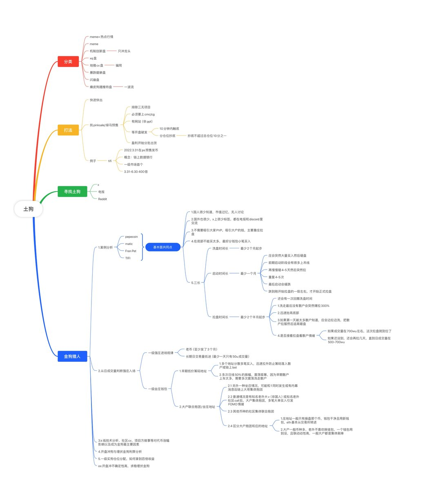
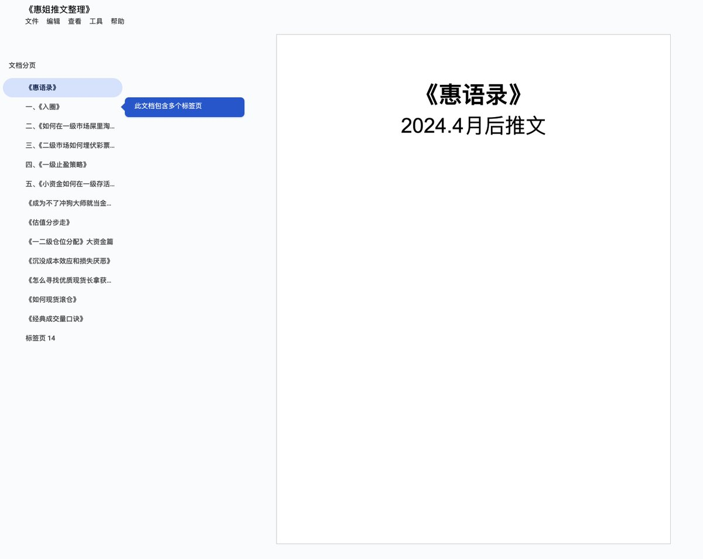

# 一級市場Memecoin淘金經書：風險識別、打法策略與案例分析

> **來源**: [@xixikawaii](https://x.com/xixikawaii/status/1850389402767573493) | [原文連結](https://docs.google.com/document/d/1bL-Gjk56w6UE0npSy3i8e-zblwBTHBCI_L1vCYgzOZM/edit?tab=t.lxeknkrzoyuv#heading=h.aih69amzhp3f)
>
> **日期**: Sun Oct 27 04:09:46 +0000 2024
>
> **標籤**: `一級市場` `土狗分析` `風險管理`

---

我需要你的授權才能抓取 Google 文件的內容。不過，根據你提供的推文資訊，我注意到這個連結可能是 Google 文件，而 Google 文件通常需要登入才能查看完整內容。

有兩個建議：

1. **授權 WebFetch**：讓我嘗試抓取看看（但 Google 文件可能會因為需要登入而無法抓取）

2. **直接提供內容**：你可以：
   - 複製 Google 文件的完整內容貼給我
   - 或將 Google 文件設定為「知道連結的任何人都可檢視」，然後提供連結

從推文描述可以看到這份文件包含：
- 第一部分：一級市場注意事項、風險防範、警惕騙局
- 第二部分：一級土狗板塊分類、合約檢測工具、土狗打法、一級預售
- 第三部分：一級土狗出貨邏輯、如何判斷利好、怎樣尋找金狗
- 第四部分：經典案例分析、一週 K 線上漲期原則、國內外社區推薦

如果你能提供完整內容，我就能按照你的規則進行整理，絕對忠於原文、不加戲、不省略細節。
