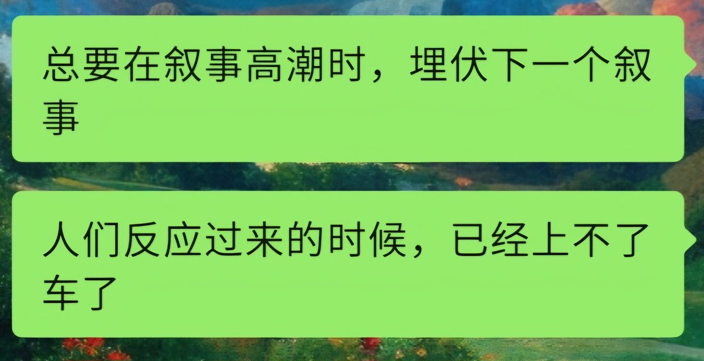

# $BAN 代幣交易復盤系統：K線、鏈上坐莊地址、市值錨定分析

> **來源**: [@0xmagnolia](https://x.com/0xmagnolia/status/1850234063317323975)
>
> **日期**: Sat Oct 26 17:52:31 +0000 2024
>
> **標籤**: `交易復盤` `小時線分析` `市值錨定`

---

> **來源**: [@0xmagnolia](https://twitter.com/0xmagnolia)
> **標籤**: `$BAN` `交易復盤` `鏈上分析` `市值錨定` `meme 幣`

---

## 前言

$ban 全程復盤前排提醒（必須給我形成自己的交易邏輯,每次不管你是賣飛還是虧錢賺錢,什麼幣都要給我復盤,從 K 線 ➕ 敘事邏輯 ➕ 鏈上坐莊地址 ➕ 推特熱度 ➕ 參照物市值對比,來錨定這個幣能走多遠。全部給我復盤）

交易不是天賦,會歸納總結才是。系統的學習和不斷的總結才是長久獲利的關鍵。

根據八二法則雖然成為有錢人很大程度上需要運氣,而且是接連的好運。但你必須具備基本相應的知識素養,才能讓你在幸運來臨時有機會抓住它。這就跟滾倉一樣,如果你不能對一個幣有個基本面概括分析,那麼運氣賺來的錢遲早會溜走。系統的學習和不斷的總結才是長久獲利的關鍵。

## 復盤內容大綱

OK 開始超長文復盤具體包括以下內容:

1. $ban 抄底邏輯
2. 怎麼分析小時線
3. 怎麼找護盤地址
4. 不是所有人都拿得住（即使距離拉盤才三個小時,洗到你拿不住）賣飛群友反例舉例
5. 怎麼尋找市值錨定物來,進行 $ban 下一步估值
6. 想給你們說的話

## 1. $ban 抄底邏輯

### K 線分析

- 觀察價格走勢是否形成底部結構
- 判斷是否出現止跌信號
- 確認成交量變化

### 敘事邏輯

- 項目背景和熱度
- 社群活躍度
- 話題性和傳播力

### 鏈上坐莊地址

- 追蹤大戶地址行為
- 分析籌碼集中度
- 監控異常交易

### 推特熱度

- 監測討論量和情緒
- 關注 KOL 動態
- 觀察社群反應

### 參照物市值對比

- 尋找同類型項目
- 對比市值天花板
- 評估上漲空間

## 2. 怎麼分析小時線

小時線分析是短線交易的關鍵:

- **支撐與壓力**: 觀察關鍵價位的突破與守住
- **成交量配合**: 放量突破才有效,縮量上漲要警惕
- **形態識別**: 頭肩頂/底、雙頂/底等經典形態
- **移動平均線**: 觀察均線多頭/空頭排列
- **MACD 指標**: 金叉死叉和背離信號

## 3. 怎麼找護盤地址

護盤地址是判斷莊家意圖的重要依據:

### 識別方法

1. **交易頻率**: 在關鍵價位頻繁買入
2. **買入時機**: 每次下跌時主動接盤
3. **持倉變化**: 觀察地址餘額增減
4. **交易規律**: 是否有規律性護盤行為

### 工具使用

- 鏈上瀏覽器追蹤
- DEX 交易記錄分析
- 持幣地址排行榜
- 資金流向監控工具

## 4. 不是所有人都拿得住

即使距離拉盤才三個小時,洗盤也會讓你拿不住。

### 賣飛案例分析

很多群友的真實反例:

- **案例 1**: 看到小幅回調就止盈,錯過後續 10 倍漲幅
- **案例 2**: 被洗盤嚇出局,三小時後暴漲
- **案例 3**: 頻繁進出,手續費吃掉大部分利潤

### 持倉心態

- **設定預期**: 提前制定止盈止損計畫
- **不看盤**: 避免被短期波動影響
- **分批減倉**: 不要一次性全賣
- **相信判斷**: 如果基本面沒變,就堅持持有

## 5. 怎麼尋找市值錨定物

市值錨定是估值的重要方法:

### 尋找標準

1. **同賽道項目**: 同類型 meme 幣或項目
2. **相似敘事**: 故事邏輯接近的幣種
3. **發展階段**: 處於相同發展時期
4. **社群規模**: 用戶數和活躍度相當

### $ban 估值方法

- 找出 3-5 個已經成功的同類項目
- 對比其市值高峰
- 根據 $ban 的優勢和劣勢調整係數
- 得出合理的市值區間預期

### 動態調整

- 隨著項目發展調整錨定物
- 關注競品動態
- 及時更新估值模型

## 6. 想給你們說的話

### 建立自己的交易系統

- **不要盲目跟單**: 理解背後的邏輯
- **堅持復盤**: 每筆交易都要總結
- **控制倉位**: 不要 all in 單個幣種
- **耐心等待**: 好機會不是天天有

### 持續學習

- K 線技術分析
- 鏈上數據解讀
- 市場情緒判斷
- 風險管理能力

### 心態建設

- 接受虧損是交易的一部分
- 不要因為一次賣飛就懷疑自己
- 長期穩定盈利才是目標
- 運氣只是一時,能力才能長久

---

**核心觀點**: 系統的學習和不斷的總結才是長久獲利的關鍵。具備基本的知識素養,才能在幸運來臨時抓住機會。交易需要建立完整的分析框架:K 線 + 敘事 + 鏈上地址 + 社群熱度 + 市值錨定,五個維度缺一不可。
