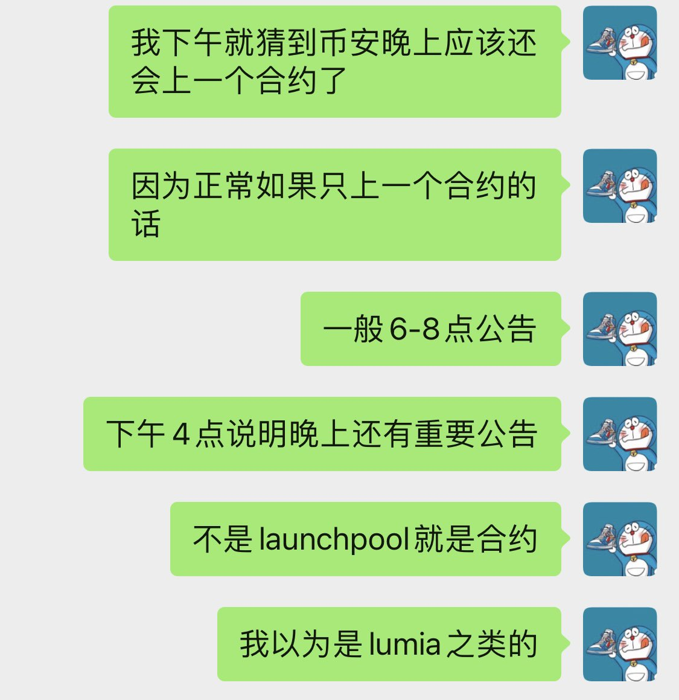
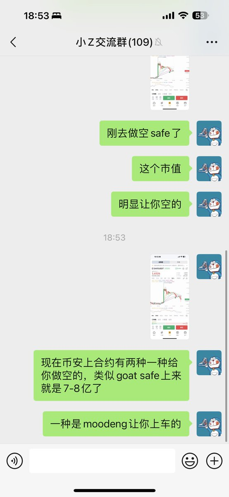

# 幣安合約上新時間博弈策略分析

> **來源**: [@richrichardoz](https://x.com/richrichardoz/status/1849767172689756279) | [原文連結](https://twitter.com/richrichardoz/status/1849767172689756279/photo/1)
>
> **日期**: Fri Oct 25 10:57:15 +0000 2024
>
> **標籤**: `合約上新` `時間預測` `交易策略`

---

> **來源**: [@richrichardoz (小Z)](https://twitter.com/richrichrichardoz)
> **日期**: 2024-11-12
> **標籤**: `幣安` `合約上新` `交易策略` `市場時機`

---

## 幣安合約上新時間規律

下午我就猜到幣安應該還會上一個合約。因為幣安如果當天只有一個合約上新公告的話，一般都是 6-8 點發。下午 4 點上河馬（HIPPO），晚上大概率還有一個。

## 合約上新的博弈策略

現在幣安公告的博弈也很有意思，例如上新：

- **河馬（HIPPO）**：這種就是讓你上車的
- **GOAT**：這種就是給你做空的

## 核心洞察

不同的合約上新時間點和標的，暗示著不同的市場意圖：

- 單獨發布時間：通常在 6-8 點
- 下午發布一個：晚上大機率還有第二個
- 需要判斷標的特性來決定是做多（上車）還是做空
