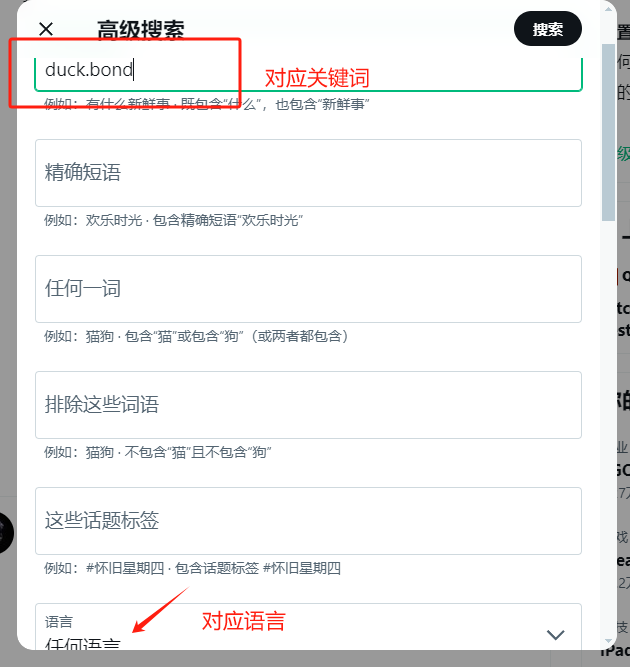
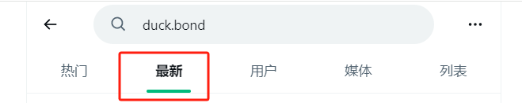
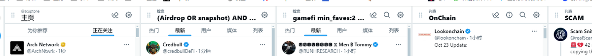

# 早期部落客發現方法 - 建立高效資訊流

> **來源**: [@scuptone](https://x.com/scuptone/status/1849167532089126956)
>
> **日期**: Wed Oct 23 19:14:30 +0000 2024
>
> **標籤**: `資訊流篩選` `部落客追蹤` `市場研究`

---

> **來源**: [@scuptone (貓老師scupt)](https://x.com/scuptone)
> **日期**: 2025-01-18
> **標籤**: `資訊流` `Twitter` `KOL發現` `早期信號`

---

## 方法概述

簡單教一下大家找到小眾早期博主，而不是在微信群或者轉發群吃 10 手資訊。

以 duck 為例，有效早期資訊元素是對應網址，而不是 CA（每個項目自己過濾一下核心關鍵詞）。所以對應關鍵詞是 `duck.bond` 這個網站。

## 篩選步驟

你只需要找到 2 個維度的早期即可，**只看前 5 條即可**：

1. **簡體/繁體中文最早發的**
2. **英語類最早發的**

過濾垃圾博主，即可每次整理得到早期博主，進行累計匯總即可獲得自己有效的資訊流。

## 致謝

珍惜這些博主，感謝他們的無償的整理並發送，雖然他們經常閱讀不過 500，但是他們總在努力。再次感謝他們的付出。
