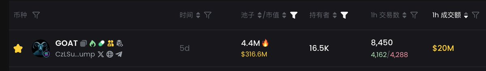

# $GOAT 代幣鏈上一小時成交量分析

> **來源**: [@szu_jason](https://x.com/szu_jason/status/1846466846385754228) | [原文連結](https://twitter.com/szu_jason/status/1846466846385754228/photo/1)
>
> **日期**: Wed Oct 16 08:22:56 +0000 2024
>
> **標籤**: `代幣成交量` `鏈上數據` `市場微觀結構`

---

> **來源**: [@szu_jason (吟唱法師🧙⚡️💎)](https://twitter.com/szu_jason)  
> **日期**: 2026-02-18  
> **標籤**: `GOAT` `鏈上數據` `成交量分析` `Solana`

---

## 成交量數據

$GOAT 代幣鏈上一小時成交量高達 20M（2000 萬美元），這個成交量數據非常驚人。

## 含金量評價

這個成交量數據反映了該代幣和所在鏈的含金量（市場活躍度和真實交易需求）都極高。
