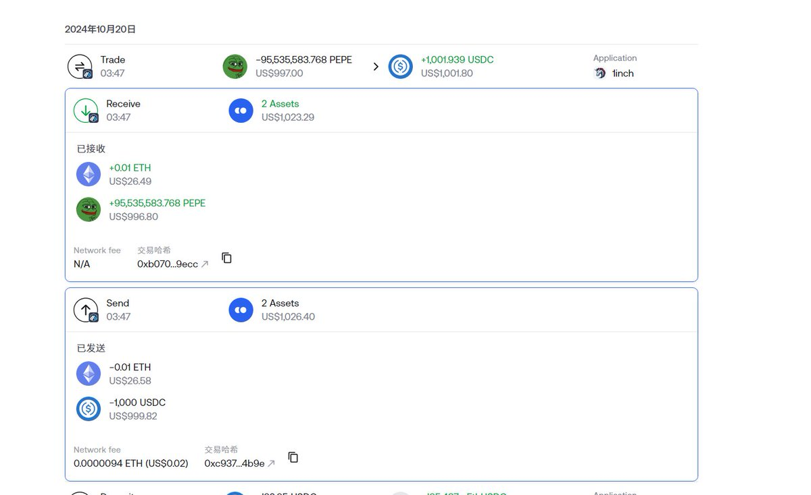

# DEX 與 GMX 套利策略：零回撤月收益 2000U

> **來源**: [@zhamomo666](https://x.com/zhamomo666/status/1847747637812077004) | [原文連結](https://twitter.com/zhamomo666/status/1847747637812077004/photo/1)
>
> **日期**: Sat Oct 19 21:12:21 +0000 2024
>
> **標籤**: `套利策略` `DEX 交易` `風險管理`

---

> **來源**: [@zhamomo666 (愛套利的渣沫沫)](https://twitter.com/zhamomo666)
> **日期**: 2024
> **標籤**: `DEX` `GMX` `套利` `零回撤` `鏈上交易`

---

## 策略概述

這個套利方式在 DEX 和 GMX 之間進行套利操作。

## 運作方式

檢測 GMX 和鏈上的價差，進行買賣操作。

## 收益特徵

- **回撤**: 可以說是零回撤
- **收益**: 一個月能賺 2000U 左右
