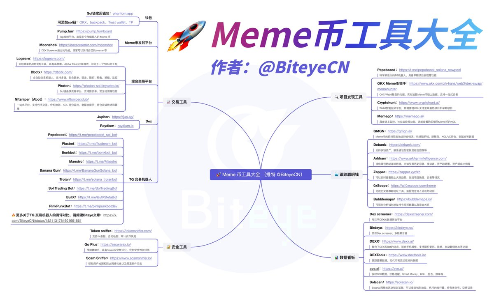

# Meme幣交易工具大全：發現百倍機會

> **來源**: [@BiteyeCN](https://x.com/BiteyeCN/status/1846514717109690504)
>
> **日期**: Wed Oct 16 11:33:09 +0000 2024
>
> **標籤**: `Meme幣` `交易工具` `鏈上監控`

---

> **來源**: [@BiteyeCN (Biteye)](https://x.com/BiteyeCN)
> **日期**: 2024-10-16
> **標籤**: `memecoin` `交易工具` `鏈上監控` `聰明錢` `安全工具`

---

## 背景

$GOAT 市值已經突破3億美元，AI發幣都起飛了，Meme賽道熱度不能忽視！「Memecoin Super Cycle」或許不再是口嗨...

Biteye整理了一些玩Meme的實用工具，涵蓋鏈上監控和交易。

## 工具分類

### 1️⃣ 發現Meme幣

用於發現新興或潛力Meme幣的工具。

### 2️⃣ 跟踪聰明錢

追蹤聰明錢地址，了解大戶動向和交易策略。

### 3️⃣ 數據看板

查看Meme幣的市值、交易量、持倉分布等關鍵數據。

### 4️⃣ 交易工具

用於快速交易、狙擊新幣、設置止盈止損的工具。

### 5️⃣ 安全工具

檢測合約安全性、防範Rug Pull、識別蜜罐合約等風險管理工具。

---

**注意**：原推文僅提供工具分類框架，詳細工具列表需參考原文完整內容或後續補充。
