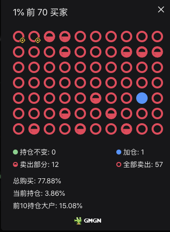
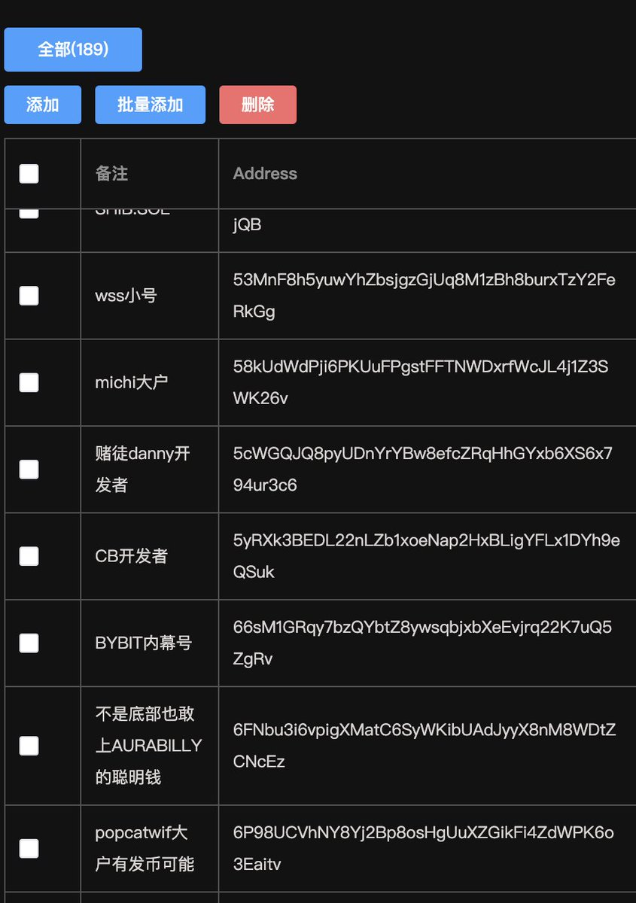

# 聰明錢包篩選策略：如何用 GMGN 發現頂級交易者

> **來源**: [@0xseven1](https://x.com/0xseven1/status/1846054431890235850) | [原文連結](https://gmgn.ai/trend/Sa1ni0WxJ?chain=sol)
>
> **日期**: 
>
> **標籤**: `聰明錢追蹤` `錢包分析` `Solana 交易`

---

> **來源**: [@0xseven1 (Evan)](https://twitter.com/0xseven1)
> **日期**: 2026-02-18
> **標籤**: `GMGN` `聰明錢包` `鏈上分析` `錢包篩選` `內幕交易`

---

## 什麼是聰明錢包篩選

很多人還不知道怎麼扒聰明錢包。這裡分享一個最簡單的方法，透過 GMGN.AI 工具來尋找和監控頂級交易者。

## 如何尋找聰明錢

### 使用 GMGN 篩選狙擊者

1. 打開 GMGN [@gmgnai](https://gmgn.ai)
2. 以 1% 的代幣為例，找到右上角的「狙擊者」功能
3. 前排顯示的都是內盤很厲害的大手子
4. 逐個點進去查看：
   - 看到 0.1、0.2 SOL 的一般都是 bot 量化
   - **重點關注**：看到 1-5 個 SOL 底部塞進去的錢包
5. 分析這些錢包：判斷是運氣好還是技術特別好的大神

### 建立聰明錢資料庫

每天都有上百萬級別的盤子，你總能找出來幾個優質錢包：

1. 找出聰明錢包後，用 Ray 打上備註監控
2. Ray 工具比 GMGN 自己的 bot 快一些，但價格挺貴（1 年 2 SOL）

## 進階：尋找陰謀集團錢包

### 查找錢包關聯

經過一段時間的扒聰明錢包，鏈上工具用熟了之後：

1. **查關聯**：查他們之間的互相轉帳記錄
2. **建立資料庫**：這是一個過程，不可能一天兩天就結束
3. **時間週期**：資料庫大概需要 7-15 天，見過無數的百萬級別金狗才能建立起來
4. **跟單策略**：後面就可以承擔一些風險，跟住這些錢包底部進場

## GMGN.AI 工具功能

- Fast Trade（快速交易）
- Fast Copy Trade（快速跟單）
- Fast AFK Automation（自動化掛機）
- CA Security Checks（合約安全檢查）：LP 燒毀、蜜罐檢測、Renounced、可鑄造性
- 監控內幕交易者、狙擊者、前 70 名買家的持倉
- 新代幣 FOMO 提醒
- 整合 GMGN 價格圖表
- Solana Rug Pull 代幣蜜罐檢測
