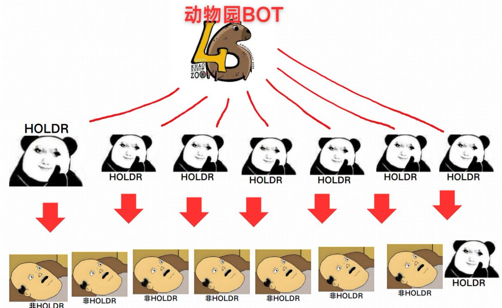

# 動物園社區 Solana 交易機器人開源專案

> **來源**: [@toupaiwang](https://x.com/toupaiwang/status/1845439126985736271) | [原文連結](https://github.com/toupaiwang/tradingbot)
>
> **日期**: Sun Oct 13 12:19:09 +0000 2024
>
> **標籤**: `交易機器人` `Solana` `社區建設`

---



> **來源**: [@toupaiwang (币圈偷拍王-科学家俱乐部)](https://twitter.com/toupaiwang)
> **日期**: 2026-02-18
> **標籤**: `Solana` `交易機器人` `開源專案` `Telegram Bot` `Jito`

---

## 專案背景

這是動物園社區的交易 BOT 開源專案。在動物園初始建設的時候，開發者思考如何搭建一個基礎設施讓所有人收益，同時擴大影響力，拉盤幣價。

參考了 BANANA 和 BONK 的交易機器人模式，這些知名代幣擁有自己的 BOT，將收集的手續費用於回購代幣，從而給代幣價格做拉升和托底，增加社區信心。

## 專案特色

### 核心功能

1. **邀請返佣系統**：機器人自帶邀請鏈接返佣功能，現在鏈上 MEME 非常火爆，幾乎人人使用 BOT
2. **社區推廣**：BOT 頁面自帶動物園社區介紹，新用戶打開時可以看到動物園的相關資訊
3. **被動建設**：即使用戶對動物園不感興趣，他們產生的手續費也會被用於回購動物園代幣，無形中幫助建設社區
4. **主動參與**：用戶發現 BOT 由動物園社區驅動，可能對社區產生興趣，進而加入、了解、參與建設
5. **推廣激勵**：推廣機器人的個體通過邀請返佣獲得收益，同時完成動物園的建設工作

### 開源理念

開發者選擇開源這個機器人的三個原因：

1. 讓大家看清楚誰在黑他
2. 希望有大神幫忙找找 BUG
3. 為開源社區做貢獻

**獎勵機制**：提供 PR 的人會獲得獎勵

## 技術架構

### 技術棧

- **框架**：Nest.js
- **資料庫**：TypeOrm / MySQL（也可使用 PostgreSQL，生產環境計劃改用 PostgreSQL）
- **交易提交**：Jito（測試下來速度不錯，交易上鏈速度很快，成功率高）
- **快取**：Redis（節約 API 使用次數，檢測交易結果時使用 Redis 隊列）

### 功能完成度

- 功能完成度約 **95%**
- 部署後可以進行交易
- 一些設置功能還在使用默認值

### 架構改進計劃

暫時還沒有做模組間的微服務化，但如果用戶量上來之後應該進行微服務化改造。

## 使用指南

### 安裝與啟動

```bash
npm install
npm run build
npm run start
```

### 環境配置

需要在 `.env` 中配置相關參數：

- 資料庫設定
- Redis 設定
- Telegram Bot Token

## 安全注意事項

⚠️ **重要提醒**：請不要使用已經洩露的 TG 帳號使用這個 BOT，比如你的 TG 帳號是購買的、是共用的，因為這會導致別人隨意使用你的帳號從而輕易盜取你 BOT 上的資金。

## 專案連結

- GitHub: https://github.com/toupaiwang/tradingbot
