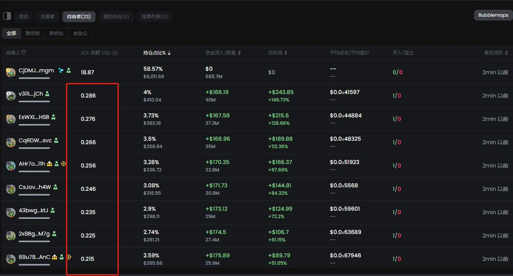

# Pump 盤割韭菜識別策略

> **來源**: [@angel_0x13](https://x.com/angel_0x13/status/1842211567846531252) | [原文連結](https://twitter.com/angel_0x13/status/1842211567846531252/photo/1)
>
> **日期**: Fri Oct 04 14:33:59 +0000 2024
>
> **標籤**: `盤口分析` `風險管理` `項目篩選`

---

> **來源**: [@angel_0x13 (小天使)](https://twitter.com/angel_0x13)
> **日期**: 2025-02-18
> **標籤**: `Pump.fun` `盤口識別` `防割韭菜` `持倉分析`

---

## 策略概述

Pump 平台上有一種盤面，看一眼就能判斷不需要參與。關鍵特徵是：**前排持有者的餘額幾乎都一樣**。

## 識別邏輯

這種持倉分布代表項目方自拉盤。無論拉到多高，大概率都是一刀割。

## 操作建議

掃鏈時看到這種盤子，直接關掉即可，省時省力。
