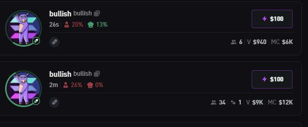
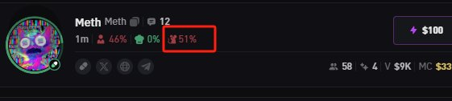
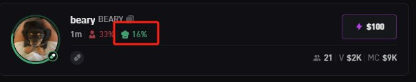
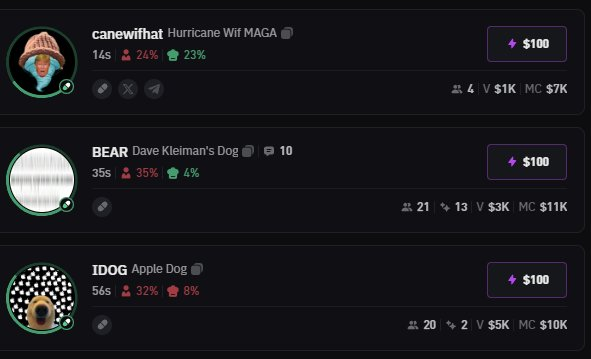

# 迷因幣掃鏈技巧：快速判斷盤子價值

> **來源**: [@angel_0x13](https://x.com/angel_0x13/status/1843479865821147455)
>
> **日期**: 
>
> **標籤**: `掃鏈技巧` `迷因幣評估` `風險篩選`

---

> **來源**: [@angel_0x13 (小天使)](https://twitter.com/angel_0x13)
> **日期**: 2026-02-18
> **標籤**: `掃鏈技巧` `迷因幣` `快速判斷` `BullX`

---

## 快速判斷盤子價值的技巧

今天講一下快速判斷需不需要看的盤子。

### 可以直接 pass 的盤子

1. **短時間同時出現一樣圖片的盤子**
   - 大概率可以直接 pass
   - 突發熱點盤子除外

2. **老鼠倉 50% 以上的盤子**
   - 大概率可以直接 pass

3. **項目方持倉過多的盤子**
   - 也可以 pass

### 多個盤子的優先順序

短時間內同時出現幾個不同的盤子，先看哪個？

- 個人做法：哪個漲得快先看哪個
- 如果都漲得一樣快，就隨便挑個喜歡的看

### 結論

知道了哪些不用看，那剩下的就得都看看了。

**掃鏈工具**: [@bullx_io](https://twitter.com/bullx_io)
