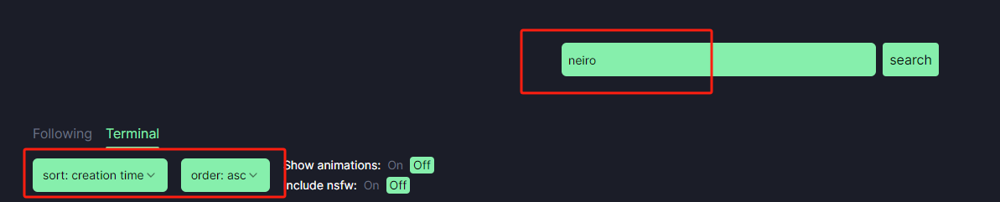
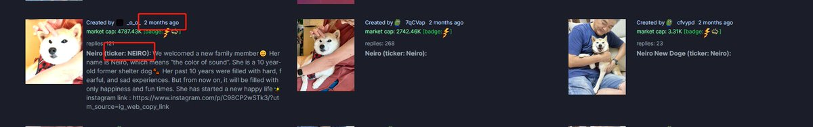

# Pump.fun 尋找 OG 項目的鏈上技巧

> **來源**: [@angel_0x13](https://x.com/angel_0x13/status/1843857706349932628) | [原文連結](https://pump.fun/)
>
> **日期**: Wed Oct 09 03:35:09 +0000 2024
>
> **標籤**: `Pump.fun` `OG項目` `早期發現`

---

> **來源**: [@angel_0x13 (小天使)](https://x.com/angel_0x13)
> **日期**: 2024
> **標籤**: `pump-fun` `og項目` `鏈上分析` `memecoin`

---

## 核心技巧

當一個 IP 話題火了之後,市場上會有人炒作該 IP 的「OG 版本」(最早部署的同名代幣)。以下是透過 Pump.fun 平台找到 OG 項目的完整方法。

## 操作步驟

### 1. 進入 Pump.fun 搜尋

打開 [Pump.fun 官網](https://pump.fun),在搜尋框輸入目標名稱（例如：`neiro`）

### 2. 設定排序規則

在左側篩選區設定：
- **排序方式**：按照部署時間排序
- **排序順序**：選擇 `asc`（升序）

這樣會顯示所有名稱包含搜尋關鍵字的項目,並且按照部署時間從最早到最晚排列。

### 3. 找到最早部署版本

向下滾動列表,即可找到該名稱最早部署的版本（OG 版本）。

## 實戰應用

當你發現一個有潛力的項目時:

1. **第一時間自己找 OG 版本**（不用等別人分享）
2. **提前埋伏**進入 OG 版本
3. **待熱度起來後**,可以向其他人宣傳（CX）並適時出貨

