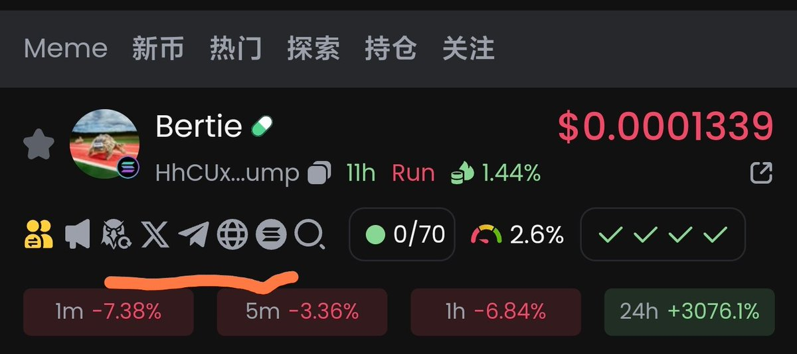
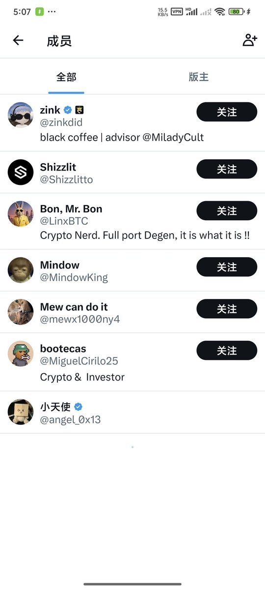
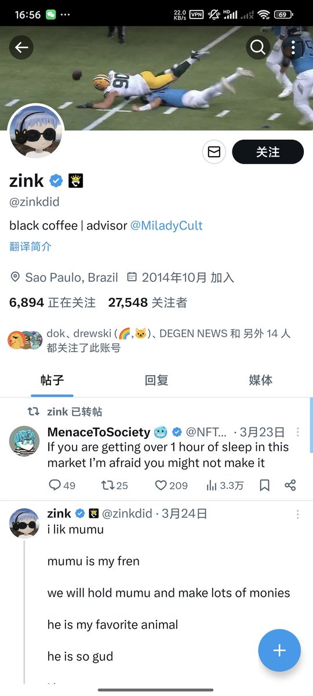
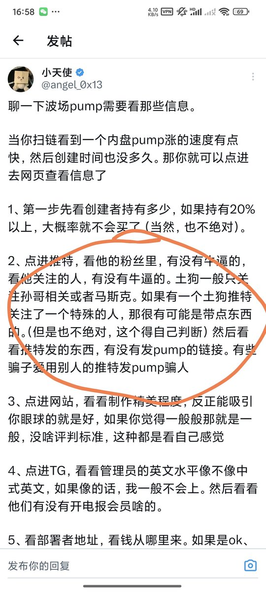

# 鏈上內幕盤判斷實戰：以 Bertie 為例的選幣策略

> **來源**: [@angel_0x13](https://x.com/angel_0x13/status/1845391226155172132)
>
> **日期**: Sun Oct 13 09:08:48 +0000 2024
>
> **標籤**: `內幕地址監控` `鏈上選幣` `Memecoin 研究`

---

> **來源**: [@angel_0x13 (小天使)](https://x.com/angel_0x13)
> **日期**: 2024
> **標籤**: `鏈上交易` `內幕盤` `選幣策略` `GMGN` `Meme Coin`

---

## 實戰案例：Bertie 金狗捕捉全過程

今天想藉著昨晚的金狗，寫一篇關於如何將教程運用到實戰的文章。

### 第一步：內幕地址監控

通過監控長期積累下來的內幕地址，發現他內盤買入了 Bertie。這使得在外面旅遊的我看到監控訊息來了，就想去打開研究一下。

但是其實這個盤子並不需要一定監控到內幕地址進場才能判斷是內幕盤。你正常掃鏈也可以判斷出來，可以看看第二步。

### 第二步：項目基本面研究

把 CA 複製進 GMGN 後，需要必看的三個東西：

1. **推特**
2. **電報群** 
3. **網站**（如果有，我都看，如果項目方沒給，那就沒辦法了）

點開推特，發現項目方鏈接的是一個推特社區。然後看成員，版主有 2 萬多粉絲，且簡介上寫著米萊狄（Milady）的顧問，然後他又不屬於經常發推的那種，所以可能是一個比較牛逼的人發的幣。

看到這裡，剩下兩個要素我都沒看，我就先幹進去再說了。如果看到這個訊息都不敢賭一下，那就別玩鏈上了。

我之前寫 SunPump 教程的時候也寫過類似的一點。這就是教程在實際中的運用。包括第一步，怎麼找的內幕地址我也在前兩天發過教程了。

### 第三步：分享訊息

把自己了解到的訊息和 CA 發到自己想發的地方，然後等收紅包就行。

---

## 總結

這就是我抓住 Bertie 的全過程。關鍵在於：

- 長期積累內幕地址監控名單
- 快速判斷項目方背景（推特社區、版主身份）
- 看到機會果斷進場，不要猶豫
