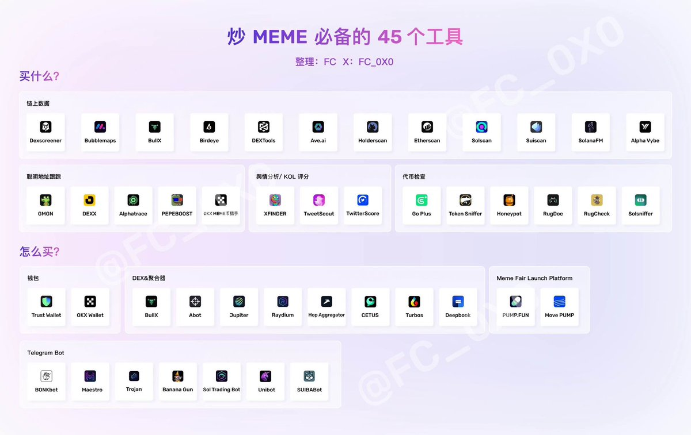

# 炒 Meme 幣必備的 45 個工具

> **來源**: [@Crypto_Cat888](https://x.com/Crypto_Cat888/status/1845463797047132640) | [原文連結](https://twitter.com/Crypto_Cat888/status/1845463797047132640/photo/1)
>
> **日期**: Sun Oct 13 13:57:10 +0000 2024
>
> **標籤**: `Meme 幣` `交易工具` `工具合集`

---

根據圖片內容，我現在可以整理出完整的知識庫文章了：

---

> **來源**: [@Crypto_Cat888 (CryptoCat 🐈)](https://x.com/Crypto_Cat888/status/1845463797047132640)
> **日期**: 2024-10-13
> **標籤**: `Meme 幣` `工具集` `鏈上數據` `錢包` `Telegram Bot`

---

本文整理了炒 Meme 幣必備的 45 個工具，涵蓋基礎設施、鏈上數據分析、發幣平台、安全檢測和 Telegram 機器人等多個類別。

## 基礎工具

### 錢包
1. **Phantom** - Solana 生態主流錢包
2. **Backpack** - 多鏈錢包
3. **OKX Wallet** - OKX 交易所錢包
4. **MetaMask** - 以太坊系錢包
5. **TPWallet** - TokenPocket 錢包
6. **Bitget Wallet** - Bitget 交易所錢包
7. **OneKey** - 開源硬體錢包
8. **CoinBase** - Coinbase 錢包

### 基礎設施
9. **Helius** - Solana RPC 節點服務
10. **QuickNode** - 多鏈節點服務
11. **SolScan** - Solana 區塊鏈瀏覽器
12. **Dextools** - DEX 交易工具

## 鏈上數據工具

### DEX 數據分析（鏈上數據）
13. **GMGN** - 鏈上數據聚合平台
14. **BullX** - 交易數據分析
15. **Photon** - 鏈上交易工具
16. **Cielo** - DeFi 數據分析
17. **Defined** - 多鏈數據追蹤
18. **SolTrending** - Solana 熱門代幣
19. **Ave** - 數據分析平台

### KOL/鏈上數據（KOL & 鏈上數據）
20. **Alphatrace** - KOL 追蹤工具
21. **TweetScout** - Twitter KOL 分析
22. **GeckoTerminal** - 多鏈 DEX 數據
23. **DexScreener** - DEX 交易對篩選
24. **Arkham** - 鏈上地址標記
25. **Nansen** - 鏈上數據分析
26. **Bubblemaps** - 代幣持倉可視化

## 發幣平台

27. **PumpFun** - Solana Meme 幣發射平台
28. **Moonshot** - Meme 幣發射平台
29. **SunPump** - TRON 生態發幣平台
30. **Virtuals** - AI Agent 代幣平台

## 測試工具

### 代幣安全檢測（測試工具）
31. **RugCheck** - 跑路風險檢測
32. **TokenSniffer** - 代幣安全掃描
33. **GoPlus** - 安全檢測 API
34. **De.fi Scanner** - DeFi 安全掃描
35. **Solsniffer** - Solana 代幣檢測
36. **Honeypot** - 蜜罐合約檢測

## Telegram Bot

37. **Trojan** - Telegram 交易機器人
38. **Pumpbot** - PumpFun 監控機器人
39. **PepeBoost** - 交易加速機器人
40. **Sol Trading Bot** - Solana 交易機器人
41. **Maestro** - 多功能交易機器人
42. **BonkBot** - Solana Meme 幣機器人
43. **Banana Gun** - 搶跑機器人
44. **Unibot** - 以太坊交易機器人
45. **Wagie Bot** - 自動化交易機器人

---

## 使用建議

### 基礎配置
- **錢包選擇**：Solana 生態建議使用 Phantom 或 Backpack，以太坊系使用 MetaMask
- **RPC 節點**：使用 Helius 或 QuickNode 獲得更快的交易速度
- **區塊鏈瀏覽器**：SolScan（Solana）、Etherscan（以太坊）

### 數據分析流程
1. **發現階段**：使用 GMGN、SolTrending 發現熱門代幣
2. **深度分析**：用 DexScreener、GeckoTerminal 查看交易對數據
3. **安全檢測**：RugCheck、TokenSniffer 檢查合約安全性
4. **持倉分析**：Bubblemaps 查看大戶持倉分布
5. **KOL 追蹤**：Alphatrace、TweetScout 追蹤聰明錢動向

### 交易執行
- **手動交易**：使用 BullX、Photon 等前端工具
- **自動化**：配置 Telegram Bot（Trojan、Maestro）進行快速交易
- **搶跑需求**：使用 Banana Gun、PepeBoost 等專業搶跑機器人

### 風險管理
- 新幣**必須**通過至少 2-3 個安全檢測工具驗證
- 檢查 Bubblemaps 避免高度集中持倉
- 使用 Arkham、Nansen 識別項目方地址
- 小額測試後再加大倉位
